# Strict Single-Factor Report

_Auto-updated at `2026-04-28T07:35:15`._

## Summary

- Frozen ref: `fresh0412_v11_n700_existing` -> `F1=0.9901`, `FN=9.8`, `FP=5` over `5/5` seeds.
- Main strict queue: `158` completed runs, decision `queue_exhausted`.
- Round-2 refinement: `8/40` completed runs, stage `strict_single_factor_round2`, status `running`.

## Interpretation

- `label_smoothing` currently best completed point is `0.15` with `F1=0.9977`, `FN=0.8`, `FP=2.6`.
- `abnormal_weight` currently best completed point is `1.5` with `F1=0.9979`, `FN=1.2`, `FP=2`.
- `stochastic_depth` currently best completed point is `0.1` with `F1=0.9975`, `FN=1.2`, `FP=2.6`.
- `GC` broad good band remains active; current lowest total error is around `5` with `F1=0.9967`, `FN=3`, `FP=2`. `1.25` is pending.
- `color` currently says red trend helps recall but faint fleet hurts FP: `c01 0.9971 / FN 0.6 / FP 3.8` vs `c02 0.9944 / FN 1.8 / FP 6.6`.

## Provisional Golden Recipe

_This is one-factor evidence only. Joint combo validation still has to be run after round-2 closes._

- `normal_ratio = 3300`: `F1=0.9973`, `FN=2.4`, `FP=1.6`
- `gc = 5`: `F1=0.9967`, `FN=3`, `FP=2`
- `label_smoothing = 0.15`: `F1=0.9977`, `FN=0.8`, `FP=2.6`
- `stochastic_depth = 0.1`: `F1=0.9975`, `FN=1.2`, `FP=2.6`
- `focal_gamma = 0.5`: `F1=0.9969`, `FN=2.8`, `FP=1.8`
- `abnormal_weight = 1.5`: `F1=0.9979`, `FN=1.2`, `FP=2`
- `ema = 0.99`: `F1=0.9972`, `FN=1`, `FP=3.2`
- `allow_tie_save = on`: `F1=0.9974`, `FN=2.2`, `FP=1.8`

## Pending Round-2 Checks

- `gc = 1.25`: `3/5` complete
- `label_smoothing = 0.125`: `0/5` complete
- `label_smoothing = 0.175`: `0/5` complete
- `stochastic_depth = 0.15`: `0/5` complete
- `focal_gamma = 1`: `0/5` complete
- `abnormal_weight = 1.2`: `0/5` complete
- `ema = 0.995`: `0/5` complete

## Plot Index

- `normal_ratio`: [normal_ratio.png](plots/normal_ratio.png)
- `per_class`: [per_class.png](plots/per_class.png)
- `lr`: [lr.png](plots/lr.png)
- `warmup`: [warmup.png](plots/warmup.png)
- `gc`: [gc.png](plots/gc.png)
- `weight_decay`: [weight_decay.png](plots/weight_decay.png)
- `smoothing`: [smoothing.png](plots/smoothing.png)
- `label_smoothing`: [label_smoothing.png](plots/label_smoothing.png)
- `stochastic_depth`: [stochastic_depth.png](plots/stochastic_depth.png)
- `focal_gamma`: [focal_gamma.png](plots/focal_gamma.png)
- `abnormal_weight`: [abnormal_weight.png](plots/abnormal_weight.png)
- `ema`: [ema.png](plots/ema.png)
- `color`: [color.png](plots/color.png)
- `allow_tie_save`: [allow_tie_save.png](plots/allow_tie_save.png)

## normal_ratio

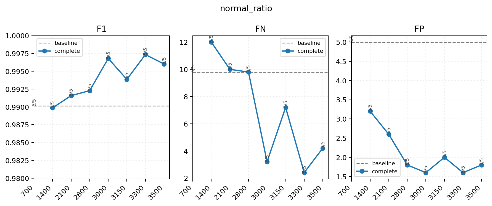

| condition | seeds | F1 | FN | FP | status | source |
| --- | ---: | ---: | ---: | ---: | --- | --- |
| 700 | 5/5 | 0.9901 | 9.8 | 5 | reference | baseline |
| 1400 | 5/5 | 0.9899 | 12 | 3.2 | complete | legacy |
| 2100 | 5/5 | 0.9916 | 10 | 2.6 | complete | legacy |
| 2800 | 5/5 | 0.9923 | 9.8 | 1.8 | complete | legacy |
| 3000 | 5/5 | 0.9968 | 3.2 | 1.6 | complete | strict |
| 3150 | 5/5 | 0.9939 | 7.2 | 2 | complete | strict |
| 3300 | 5/5 | 0.9973 | 2.4 | 1.6 | complete | strict |
| 3500 | 5/5 | 0.9960 | 4.2 | 1.8 | complete | round2 |

## per_class

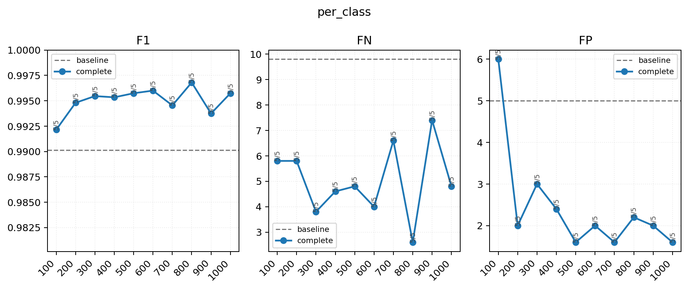

| condition | seeds | F1 | FN | FP | status | source |
| --- | ---: | ---: | ---: | ---: | --- | --- |
| 100 | 5/5 | 0.9921 | 5.8 | 6 | complete | legacy |
| 200 | 5/5 | 0.9948 | 5.8 | 2 | complete | legacy |
| 300 | 5/5 | 0.9955 | 3.8 | 3 | complete | legacy |
| 400 | 5/5 | 0.9953 | 4.6 | 2.4 | complete | legacy |
| 500 | 5/5 | 0.9957 | 4.8 | 1.6 | complete | legacy |
| 600 | 5/5 | 0.9960 | 4 | 2 | complete | legacy |
| 700 | 5/5 | 0.9945 | 6.6 | 1.6 | complete | legacy |
| 800 | 5/5 | 0.9968 | 2.6 | 2.2 | complete | legacy |
| 900 | 5/5 | 0.9937 | 7.4 | 2 | complete | legacy |
| 1000 | 5/5 | 0.9957 | 4.8 | 1.6 | complete | legacy |

## LR

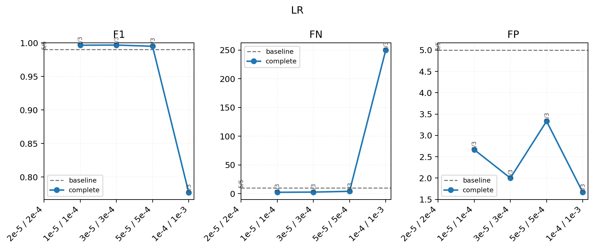

| condition | seeds | F1 | FN | FP | status | source |
| --- | ---: | ---: | ---: | ---: | --- | --- |
| 2e-5 / 2e-4 | 5/5 | 0.9901 | 9.8 | 5 | reference | baseline |
| 1e-5 / 1e-4 | 3/3 | 0.9967 | 2.333 | 2.667 | complete | legacy |
| 3e-5 / 3e-4 | 3/3 | 0.9969 | 2.667 | 2 | complete | legacy |
| 5e-5 / 5e-4 | 3/3 | 0.9951 | 4 | 3.333 | complete | legacy |
| 1e-4 / 1e-3 | 3/3 | 0.7767 | 250 | 1.667 | complete | legacy |

## warmup

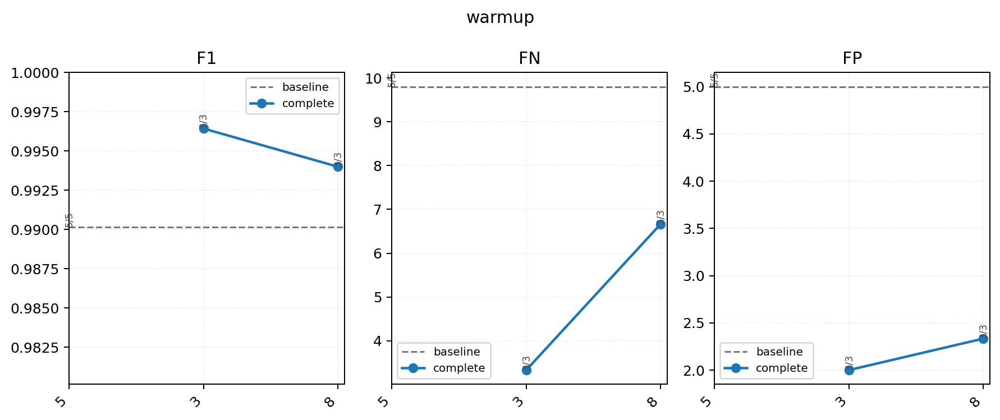

| condition | seeds | F1 | FN | FP | status | source |
| --- | ---: | ---: | ---: | ---: | --- | --- |
| 5 | 5/5 | 0.9901 | 9.8 | 5 | reference | baseline |
| 3 | 3/3 | 0.9964 | 3.333 | 2 | complete | legacy |
| 8 | 3/3 | 0.9940 | 6.667 | 2.333 | complete | legacy |

## GC

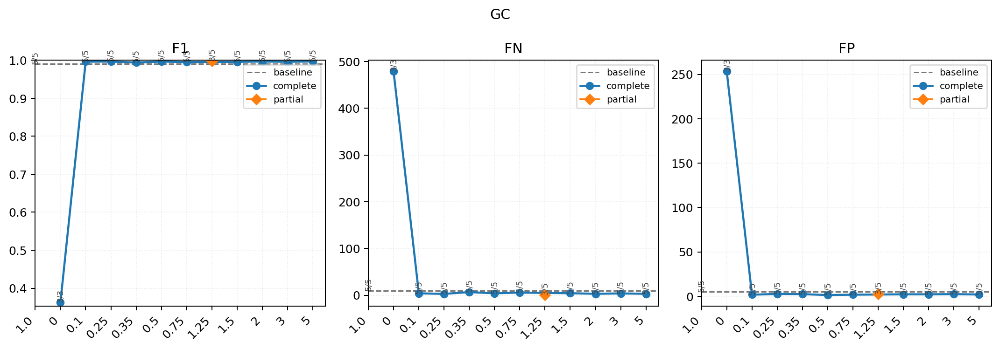

| condition | seeds | F1 | FN | FP | status | source |
| --- | ---: | ---: | ---: | ---: | --- | --- |
| 1.0 | 5/5 | 0.9901 | 9.8 | 5 | reference | baseline |
| 0 | 3/3 | 0.3626 | 478.667 | 253.333 | complete | strict |
| 0.1 | 5/5 | 0.9961 | 4 | 1.8 | complete | strict |
| 0.25 | 5/5 | 0.9964 | 2.8 | 2.6 | complete | strict |
| 0.35 | 5/5 | 0.9940 | 6.6 | 2.4 | complete | strict |
| 0.5 | 5/5 | 0.9964 | 4 | 1.4 | complete | strict |
| 0.75 | 5/5 | 0.9951 | 5.6 | 1.8 | complete | strict |
| 1.25 | 3/5 | 0.9980 | 0.333 | 2.667 | partial | round2 |
| 1.5 | 5/5 | 0.9957 | 4.2 | 2.2 | complete | strict |
| 2 | 5/5 | 0.9965 | 3 | 2.2 | complete | strict |
| 3 | 5/5 | 0.9959 | 3.8 | 2.4 | complete | strict |
| 5 | 5/5 | 0.9967 | 3 | 2 | complete | strict |

## weight_decay

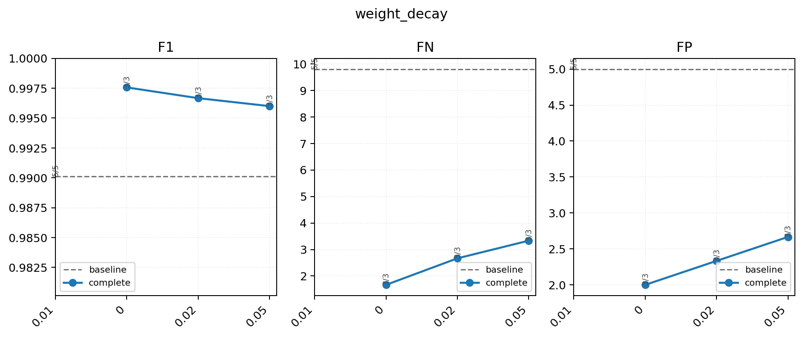

| condition | seeds | F1 | FN | FP | status | source |
| --- | ---: | ---: | ---: | ---: | --- | --- |
| 0.01 | 5/5 | 0.9901 | 9.8 | 5 | reference | baseline |
| 0 | 3/3 | 0.9976 | 1.667 | 2 | complete | legacy |
| 0.02 | 3/3 | 0.9967 | 2.667 | 2.333 | complete | legacy |
| 0.05 | 3/3 | 0.9960 | 3.333 | 2.667 | complete | legacy |

## smoothing

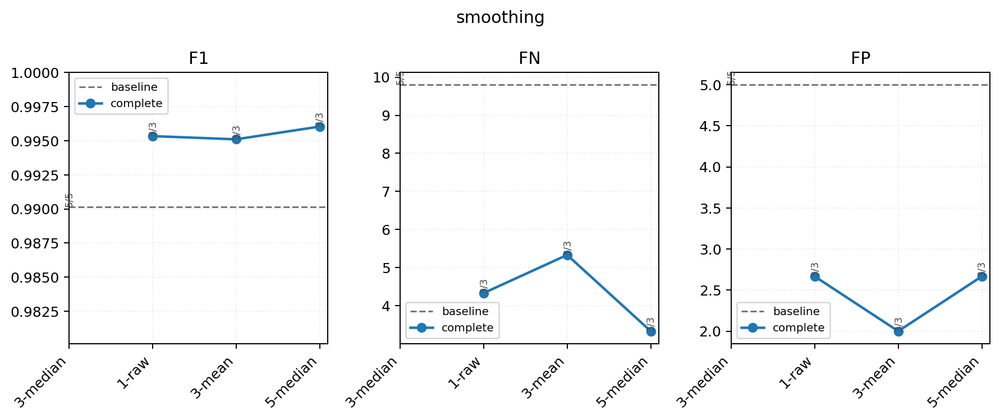

| condition | seeds | F1 | FN | FP | status | source |
| --- | ---: | ---: | ---: | ---: | --- | --- |
| 3-median | 5/5 | 0.9901 | 9.8 | 5 | reference | baseline |
| 1-raw | 3/3 | 0.9953 | 4.333 | 2.667 | complete | legacy |
| 3-mean | 3/3 | 0.9951 | 5.333 | 2 | complete | legacy |
| 5-median | 3/3 | 0.9960 | 3.333 | 2.667 | complete | legacy |

## label_smoothing

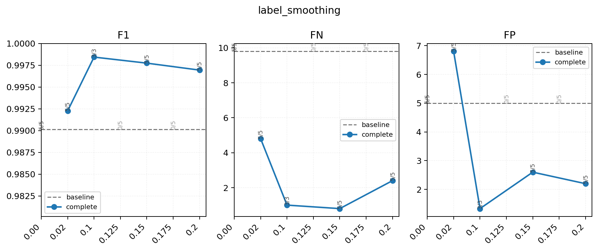

| condition | seeds | F1 | FN | FP | status | source |
| --- | ---: | ---: | ---: | ---: | --- | --- |
| 0.00 | 5/5 | 0.9901 | 9.8 | 5 | reference | baseline |
| 0.02 | 5/5 | 0.9923 | 4.8 | 6.8 | complete | strict |
| 0.1 | 3/3 | 0.9984 | 1 | 1.333 | complete | legacy |
| 0.125 | 0/5 | - | - | - | queued | round2 |
| 0.15 | 5/5 | 0.9977 | 0.8 | 2.6 | complete | strict |
| 0.175 | 0/5 | - | - | - | queued | round2 |
| 0.2 | 5/5 | 0.9969 | 2.4 | 2.2 | complete | strict |

## stochastic_depth

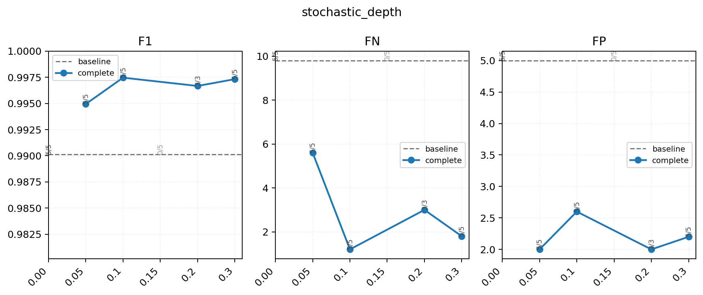

| condition | seeds | F1 | FN | FP | status | source |
| --- | ---: | ---: | ---: | ---: | --- | --- |
| 0.00 | 5/5 | 0.9901 | 9.8 | 5 | reference | baseline |
| 0.05 | 5/5 | 0.9949 | 5.6 | 2 | complete | strict |
| 0.1 | 5/5 | 0.9975 | 1.2 | 2.6 | complete | strict |
| 0.15 | 0/5 | - | - | - | queued | round2 |
| 0.2 | 3/3 | 0.9967 | 3 | 2 | complete | legacy |
| 0.3 | 5/5 | 0.9973 | 1.8 | 2.2 | complete | strict |

## focal_gamma

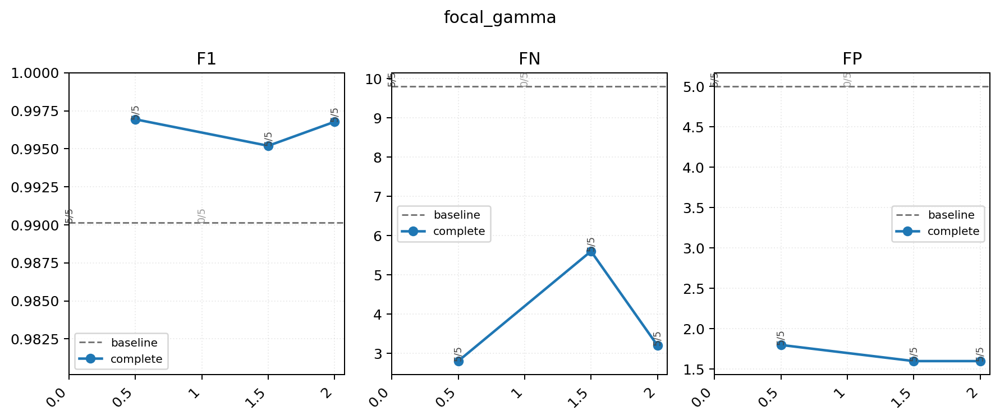

| condition | seeds | F1 | FN | FP | status | source |
| --- | ---: | ---: | ---: | ---: | --- | --- |
| 0.0 | 5/5 | 0.9901 | 9.8 | 5 | reference | baseline |
| 0.5 | 5/5 | 0.9969 | 2.8 | 1.8 | complete | strict |
| 1 | 0/5 | - | - | - | queued | round2 |
| 1.5 | 5/5 | 0.9952 | 5.6 | 1.6 | complete | strict |
| 2 | 5/5 | 0.9968 | 3.2 | 1.6 | complete | strict |

## abnormal_weight

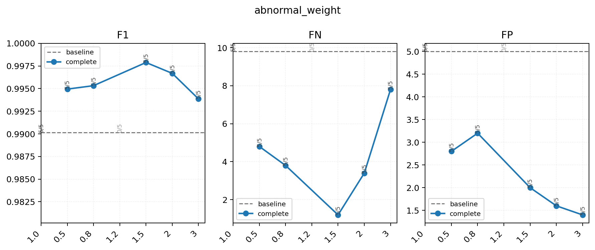

| condition | seeds | F1 | FN | FP | status | source |
| --- | ---: | ---: | ---: | ---: | --- | --- |
| 1.0 | 5/5 | 0.9901 | 9.8 | 5 | reference | baseline |
| 0.5 | 5/5 | 0.9949 | 4.8 | 2.8 | complete | strict |
| 0.8 | 5/5 | 0.9953 | 3.8 | 3.2 | complete | strict |
| 1.2 | 0/5 | - | - | - | queued | round2 |
| 1.5 | 5/5 | 0.9979 | 1.2 | 2 | complete | strict |
| 2 | 5/5 | 0.9967 | 3.4 | 1.6 | complete | strict |
| 3 | 5/5 | 0.9939 | 7.8 | 1.4 | complete | strict |

## EMA

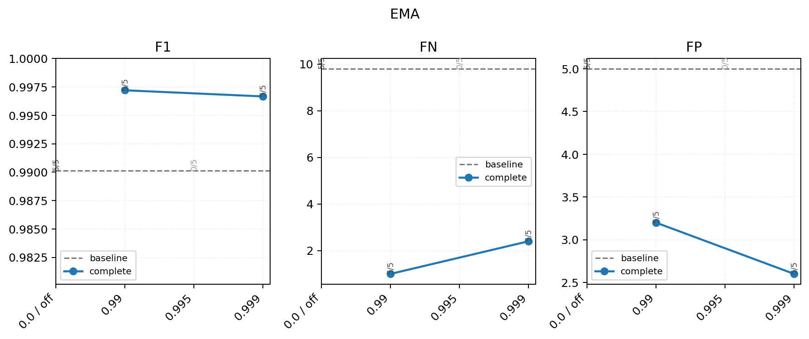

| condition | seeds | F1 | FN | FP | status | source |
| --- | ---: | ---: | ---: | ---: | --- | --- |
| 0.0 / off | 5/5 | 0.9901 | 9.8 | 5 | reference | baseline |
| 0.99 | 5/5 | 0.9972 | 1 | 3.2 | complete | strict |
| 0.995 | 0/5 | - | - | - | queued | round2 |
| 0.999 | 5/5 | 0.9967 | 2.4 | 2.6 | complete | strict |

## color

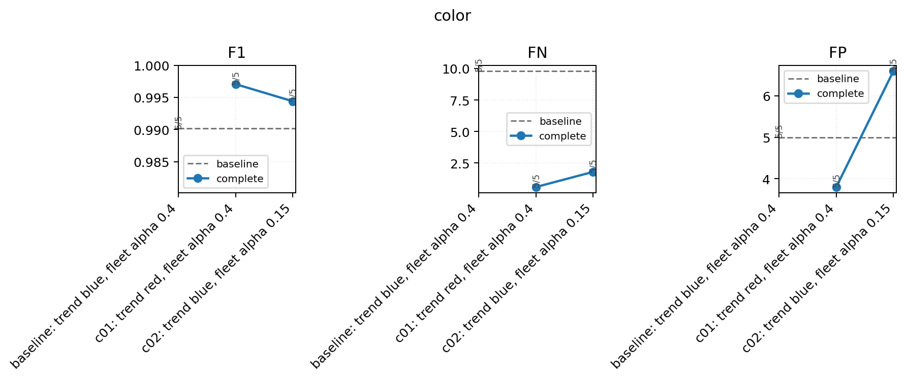

| condition | seeds | F1 | FN | FP | status | source |
| --- | ---: | ---: | ---: | ---: | --- | --- |
| baseline: trend blue, fleet alpha 0.4 | 5/5 | 0.9901 | 9.8 | 5 | reference | baseline |
| c01: trend red, fleet alpha 0.4 | 5/5 | 0.9971 | 0.6 | 3.8 | complete | strict |
| c02: trend blue, fleet alpha 0.15 | 5/5 | 0.9944 | 1.8 | 6.6 | complete | strict |

## allow_tie_save

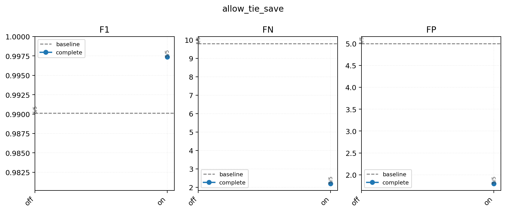

| condition | seeds | F1 | FN | FP | status | source |
| --- | ---: | ---: | ---: | ---: | --- | --- |
| off | 5/5 | 0.9901 | 9.8 | 5 | reference | baseline |
| on | 5/5 | 0.9974 | 2.2 | 1.8 | complete | strict |
