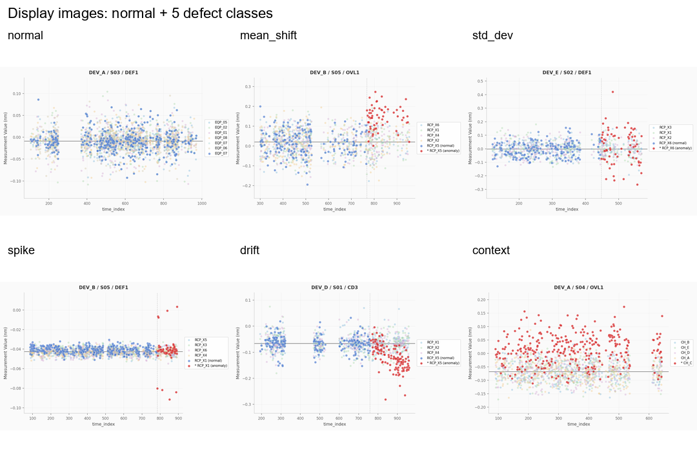
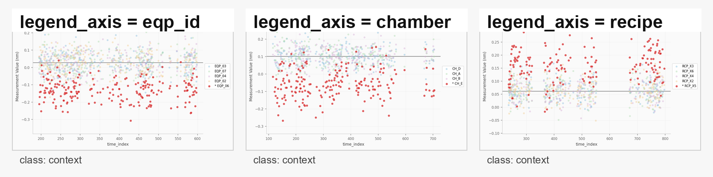
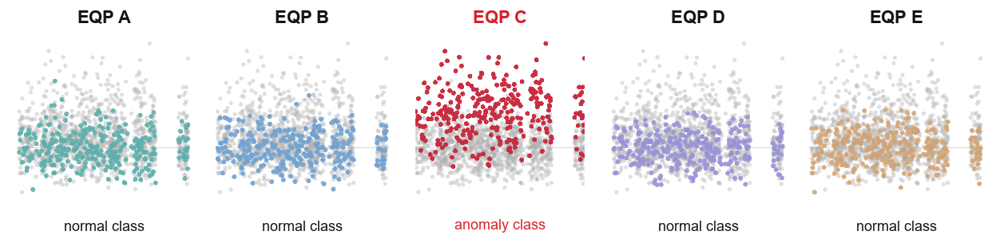
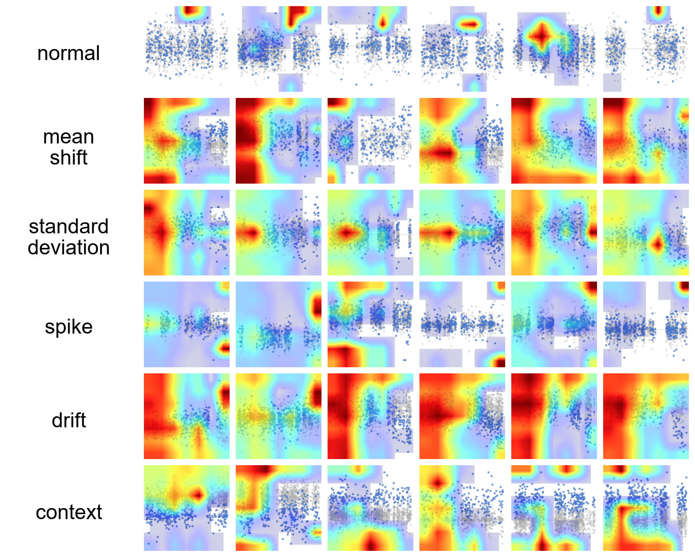
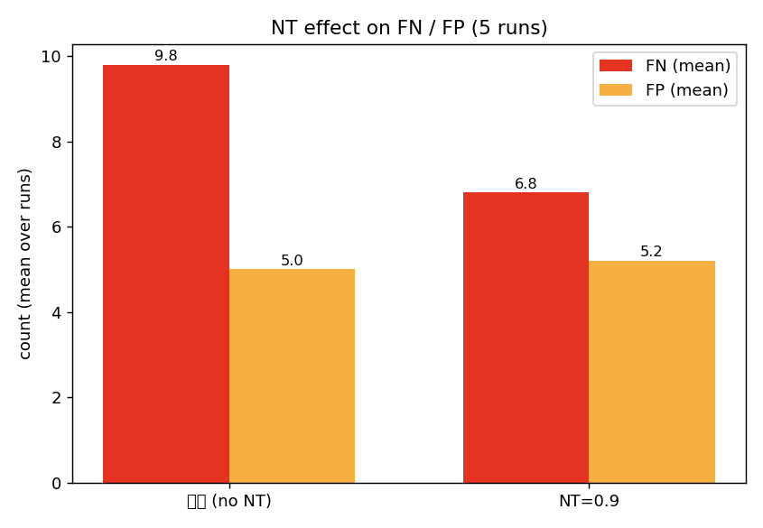

# 실험 요약

## 기술 스택

| 항목 | 값 |
| --- | --- |
| 모델 | ConvNeXtV2-Tiny (timm, ImageNet-22k→1k pretrained) |
| 입력 | trend chart PNG 224×224 (시계열 → 자체 렌더링) |
| 학습 | PyTorch · AdamW · FocalLoss · EMA · 선택적 torchrun DDP |
| 정밀도 | bf16 (H100/H200) / fp16 (4060 Ti) / fp32 |
| 평가 | binary F1, FN, FP, normal_threshold sweep |
| 추론 | 1차 binary gate → 2차 anomaly_type classifier |

## 파이프라인 구조

`bash scripts/all-dataset-backbone-ddp.sh` 한 줄로 다음이 모두 실행됩니다.

```text
사용자 ─┐
        ▼
[1] all-dataset-backbone-ddp.sh
      └─ torch.cuda.device_count() 로 visible GPU 수 N 확인
      └─ N>=2 이면 AD_TRAIN_DDP_NPROC=N export
      └─ exec all-dataset-backbone.sh
        ▼
[2] all-dataset-backbone.sh                 ◄── ① dataset yaml 7개 loop
      └─ for cfg in dataset.yaml dataset1_noise_15.yaml ... :
            run_paper_server_all.sh --skip-round1 --skip-post  ◄ prep
            sweeps_server/00_all.sh                            ◄ full sweep
      └─ dataset 종료마다 + 최종 generate_cross_dataset_report.py (비교 표/plot)
        ▼
[3] sweeps_server/00_all.sh                 ◄── ② stage loop
      └─ axis sweep (lr, warmup, normal_ratio, ...)
      └─ 13_sample_skip / 14_backbone / 15_logical_train
      └─ 16_gc (last) / 17_bkm_combined / postprocess
        ▼
[4] adaptive_experiment_controller.py       ◄── ③ run-level launch
      └─ DDP: subprocess.Popen([python, -m, torch.distributed.run, ...])
      └─ single: subprocess.Popen([python, -u, train.py, ...])
      └─ 끝나면 best_info.json 파싱 → 다음 run
        ▼
[5] train.py — single 또는 torchrun DDP
      └─ create_model → ModelEMA(model)
      └─ if WORLD_SIZE > 1:
            model = DistributedDataParallel(model)
      └─ for epoch:
            ┌────────────────────────────────────────────────────┐
            │ 1 training step (batch B):                          │
            │  · 각 rank DataLoader batch = B/N                   │
            │  · DistributedSampler 가 rank별 shard 제공          │
            │  · backward 중 gradient all-reduce                  │
            │  · 각 rank optimizer.step 1회                       │
            │ → single-GPU batch=B 한 step 과 의미적으로 동일     │
            └────────────────────────────────────────────────────┘
      └─ best_info.json / history.json / best_model.pth 저장
         (state_dict 는 _unwrap 으로 plain keys → inference 호환)
         ▲
         │ controller 가 readback 하여 results 갱신
```

핵심: 단일 process / 단일 모델 사본의 master weight + N GPU 에 forward 분산. **NCCL / DistributedSampler / torchrun / rank gating 모두 불필요**. `args.batch_size` 의미는 single-GPU 와 그대로 동일 — DP 가 내부에서 N 등분.

상세 사용법은 `HOW_TO_RUN.md` 의 *Multi-GPU* 단락.

## 프로젝트 목적과 문제 설정

이 repo는 시계열 데이터를 생성·렌더링한 trend chart image로 `normal`/`abnormal`을 판정하는 실험 파이프라인입니다. 운영 목표는 defect type 이름을 먼저 맞히는 것이 아니라 **불량 chart를 normal로 통과시키지 않는 pass/fail gate**입니다. 따라서 1차 문제는 `binary`이고, `multiclass`와 `anomaly_type`은 운영 판정을 대체하지 않고 원인 분석·리포트용 진단 모델로 둡니다.

`multiclass`를 단독 운영 gate로 쓰면 decision boundary가 `normal vs defect manifold` 분리뿐 아니라 defect 내부 type boundary까지 동시에 최적화하므로, weak/rare defect가 type 사이에서 흔들리면 `normal` 대비 margin이 작아져 FN이 늘기 쉽습니다. 그래서 gate는 `binary`로 두고 type 분류는 분리합니다.

| mode | label space | 역할 |
| --- | --- | --- |
| `binary` | `normal`, `abnormal` | 1차 운영 gate. `FN` 최소화가 핵심 |
| `multiclass` | `normal` + defect type | type별 recall/confusion matrix로 원인 분석 |
| `anomaly_type` | defect type only | binary gate 뒤 abnormal sample의 defect family 분류 |

`anomaly_type`은 PatchCore/EfficientAD 같은 normal-only one-class anomaly detection이 아닙니다. 이 repo에서는 `mean_shift`, `spike`, `drift`, `context` 같은 abnormal을 직접 생성하고 label을 붙이므로, supervised type classifier를 운영합니다. one-class 방법은 abnormal label이 적거나 unseen defect가 많을 때의 비교 baseline으로만 의미가 있습니다.

운영 구조:

```text
1단계: binary gate
  input  = chart image
  output = normal / abnormal
  목표   = FN 최소화, 허용 FP 안에서 불량 놓치지 않기

2단계: defect-type diagnosis
  input  = 1차 abnormal로 잡힌 sample
  output = mean_shift / standard_deviation / spike / drift / context
  목표   = 리포트, 원인 분석, 데이터 생성 난이도/렌더링 개선
```

2단계 classifier는 runtime에서 binary `FN`을 rescue하지 못합니다. 1단계에서 normal로 통과된 불량은 2단계로 가지 않기 때문입니다. 대신 labeled validation/test에서 binary `FN`을 true defect type별로 분해해, 어떤 anomaly가 어려운지 찾고 data generation·threshold·loss를 고치는 feedback loop로 사용합니다.

문제 설정의 상세 근거와 literature는 `docs/problem_setting.md`, 2-stage 실행·출력 해석은 `docs/two_stage_workflow.md`에 있습니다. 실행 스크립트는 `scripts/two_stage_predict.py`입니다.

### 2-stage pilot 결과 (2026-05-03)

- 1차 binary run: `logs/20260430_135349_pcsafe_00all/260430_135401_fresh0412_v11_rawbase_lr3e5_n700_s42_F0.9967_R0.9967`
- 2차 `anomaly_type` run: `logs/260503_154705_stage2_anomaly_type_pilot2_F0.7084_R0.7240`
- test 1500건, `normal_threshold=0.9`

| metric | value |
| --- | ---: |
| TN / FN / FP / TP | 746 / 1 / 4 / 749 |
| abnormal recall | 0.9987 |
| normal recall | 0.9947 |
| binary F1 | 0.9967 |

Type별 1차 error: `normal FP 4/750`, `standard_deviation FN 1/150`, 나머지 `context/drift/mean_shift/spike` FN 0/150.

2차 classifier는 **1차 predicted positive 753건** (`TP_abnormal 749 + FP_normal 4`)에만 실행됐고, 1차 FN 1건은 2차로 가지 않았습니다. 2차 type accuracy는 binary TP subset 기준 `0.7303`, 주요 약점은 `drift → mean_shift`, `spike → standard_deviation` confusion입니다. Normal FP 4건도 predicted positive라 `mean_shift` 2건, `spike` 2건으로 가짜 type이 붙으므로, 운영 리포트에는 FP contamination을 따로 표시해야 합니다.

## 실험 방식

- 같은 baseline에서 한 번에 하나의 축만 바꾸는 strict one-factor 실험.
- 기본 seed 5개: `42, 1, 2, 3, 4`. 성능은 F1, FN, FP, 완료 seed 수로 봅니다.
- baseline은 `fresh0412_v11_refcheck_raw_n700` (raw smoothing, `grad_clip=0`, `label_smoothing=0`, `NT=0.9`).
- 실행: `bash scripts/sweeps_server/00_all.sh` 한 줄. GPU 메모리·CPU 수로 `server`/`pc`/`minimal` 프로필을 자동 선택합니다.

## Run Reliability Incident Log

Updated on 2026-05-27:

- Added runtime preflight for the `torch`/`torchvision` binary pair after a server run failed at torchrun child startup with `RuntimeError: operator torchvision::nms does not exist`. The root cause is an environment mismatch, not a candidate/backbone setting; `ChildFailedError` is torchrun's wrapper around the first child failure. The documented recovery now uses the company PyPI/mirror with explicit `torch==2.3.1+cu121`, `torchvision==0.18.1+cu121`, and `torchaudio==2.3.1+cu121`, plus pip cache cleanup; no external PyTorch index URL is required. Changed files: `scripts/check_torch_runtime.py`, `scripts/run_full.sh`, `scripts/run_paper_matrix.sh`, `scripts/run_paper_server_all.sh`, `scripts/run_field_predict.sh`, `scripts/run_field_finetune.sh`, `requirements.txt`, `docs/server_full_run_and_field_data.md`, `HOW_TO_RUN.md`. Verification: Python `py_compile`, Git Bash `bash -n` for changed wrappers, and `git diff --check`.
- `scripts/sweeps_server/00_all.sh` no longer prints parenthesized skip labels for stages 13/14/15. This avoids the server-side failure observed after `02_sweep_results` when the skipped stage message was parsed as `syntax error near unexpected token '('`. Changed file: `scripts/sweeps_server/00_all.sh`. Verification: Git Bash `bash -n` for every `scripts/sweeps_server/*.sh` file and `bash scripts/sweeps_server/00_all.sh --help` smoke.

Updated on 2026-05-21:

- DDP torchrun launches no longer rely on `--standalone` auto rendezvous port selection. `scripts/adaptive_experiment_controller.py` now assigns a per-run `127.0.0.1:<free_port>` via `--master-addr/--master-port`, strips stale distributed env vars before spawning torchrun, starts each launch in its own process group, cleans up residual torchrun/train processes between queued runs, waits `AD_TRAIN_RUN_CLEANUP_SLEEP` seconds (default 5), and retries DDP init listen failures before marking a run failed. This targets failures like `DistNetworkError: server socket has failed to listen on any local network address` that can occur between sequential seed launches before training reaches epoch 1. Changed file: `scripts/adaptive_experiment_controller.py`. Verification: Python `py_compile`, DDP dry-run command check with `AD_TRAIN_DDP_NPROC=2`, and `git diff --check`.
- Server batch reporting now refreshes intermediate and final performance artifacts. `scripts/sweeps_server/14_backbone.sh` passes live comparison outputs to `scripts/adaptive_experiment_controller.py`, so `04_backbone_results.md` and `04_backbone_plot.png` are regenerated after each completed backbone run update. `scripts/all-dataset-backbone.sh` now refreshes `validations/cross_dataset_report_<timestamp>/` after each dataset finishes and once more at final completion. `scripts/generate_cross_dataset_report.py` also writes `cross_dataset_overall.csv` and `cross_dataset_overall.png` with mean F1/FN/FP across available datasets. Changed files: `scripts/adaptive_experiment_controller.py`, `scripts/sweeps_server/14_backbone.sh`, `scripts/all-dataset-backbone.sh`, `scripts/generate_cross_dataset_report.py`, `HOW_TO_RUN.md`, `README.md`. Verification: Python `py_compile`, Git Bash `bash -n` for changed wrappers, Git Bash wrapper `--help` smoke, no-training `all-dataset-backbone.sh --skip-prep --skip-full` smoke, existing-validation smoke for `generate_cross_dataset_report.py` and `generate_stage_comparison.py`, controller `--dry-run` smoke with live comparison args, and `git diff --check`.

Updated on 2026-05-12:

- Pretrained backbone load rule: `download.py` saves `timm.create_model(model_name, pretrained=True).state_dict()` to `weights/{model_name}.pth`. `train.py::create_model` must load the same file with `torch.load(weights_path, map_location="cpu")` and pass that object directly to `model.load_state_dict(state_dict)`. Do not pass misspelled or version-sensitive `weights_only` kwargs here. Changed file: `train.py`. Verification command used:

```powershell
@'
import torch, timm
from pathlib import Path
name = "convnextv2_tiny.fcmae_ft_in22k_in1k"
path = Path("weights") / f"{name}.pth"
model = timm.create_model(name, pretrained=False)
state = torch.load(path, map_location="cpu")
print(model.load_state_dict(state))
'@ | python -
```

Result: `missing=[]`, `unexpected=[]` for `weights/convnextv2_tiny.fcmae_ft_in22k_in1k.pth`.

- Inference checkpoint load should also treat `best_model.pth` as a plain state_dict. Changed file: `inference.py`, replacing `torch.load(..., weights_only=True)` with `torch.load(..., map_location=device)`.
- `scripts/all-dataset-backbone.sh` previously forced `--skip-weights` during prep, so `download.py` was skipped even when weights were missing. That made prep look like it progressed until training failed at weight load. Default behavior is now weights + data + baseline prep; `--skip-weights` is explicit and only for closed-network machines where `weights/*.pth` already exists.
- `scripts/adaptive_experiment_controller.py` previously searched all of `logs/` for a completed tag even when a fresh `--log_dir_group` was supplied. A new run could therefore reuse an old same-tag run from another group and end early. Completed-run lookup is now scoped to `logs/<log_dir_group>/` when the group is provided.
- `magic_number = pickle_module.load(...)` in a traceback is PyTorch failing while reading the checkpoint header inside `torch.load`; in this project it means `weights/*.pth` exists but is not a valid state_dict or was truncated/corrupted during download/copy. Proactive guard added after the incident: `scripts/adaptive_experiment_controller.py` now checks `weights/{model_name}.pth` before launching each train run, actually calls `torch.load(..., map_location="cpu")`, and stops with `failure_stage=preflight_weights` if the file is missing or unreadable. `download.py` verifies existing and newly downloaded `.pth` files and re-downloads invalid existing files. `train.py` raises a clear recovery message for unreadable or mismatched weights.
- `scripts/all-dataset-backbone.sh --skip-weights` fails immediately when no usable `weights/*.pth` exists.
- Controller completion detection now treats only `학습 완료` as the completion marker; `CM_NT` is no longer used as a completion signal.
- PC/minimal runtime profile previously set `max_launched=1`, so each controller call intentionally launched one train run and exited; users had to rerun the wrapper to advance the queue. `scripts/sweeps_server/_common.sh` now uses `max_launched=0` for PC/minimal too, so the queue runs through unless `--max-launched` is explicitly supplied.
- Server runtime profile now uses `num_workers=48` instead of `24` in `scripts/sweeps_server/_common.sh`; `HOW_TO_RUN.md` profile table is updated to match. Verification: Git Bash `bash -n scripts/sweeps_server/_common.sh`, direct `detect_profile`, Python static check for `PROFILE_NUM_WORKERS=48`, and `git diff --check`.
- Backbone candidate set changed: add `convnext_tiny.dinov3_lvd1689m`, replace Swin v1 with `swinv2_cr_tiny_ns_224.sw_in1k`, and remove ViT. `scripts/sweeps_server/14_backbone.sh` and `scripts/smoke_one_epoch_all_backbones.sh` now follow `download.py::MODELS` order first and skip stale `vit_*`/Swin v1 `swin_*` weights left in `weights/`. DINOv3 ConvNeXt ships as a feature backbone, so `train.py` and `inference.py` now fall back to `model.num_features` when replacing an identity classifier head. Verification: `python download.py`, strict `train.create_model(...).load + forward` for all current `download.py::MODELS`, `python -m py_compile download.py train.py inference.py scripts/adaptive_experiment_controller.py`, Git Bash `bash -n` for changed shell wrappers, and `git diff --check`.
- On Windows, `num_workers>0` in PyTorch DataLoader can hang after `학습 시작` or fail with `RuntimeError: Couldn't open shared file mapping ... error code: 1455`. `train.py` now forces `num_workers=0` on Windows by default and prints `Epoch N/M start` before the first batch so a true DataLoader stall is visible. Override only for testing with `AD_ALLOW_WINDOWS_DATALOADER_WORKERS=1`.
- Repeated reruns can appear to "progress further" when a previous attempt left partial dataset/image artifacts. Fixed behavior: `scripts/run_paper_server_all.sh` now checks that every scenario has a rendered training image before declaring the dataset ready; `generate_images.py` exits nonzero if not all scenarios render; `train.py` raises on missing rendered images instead of silently dropping samples. Verification: `python -m py_compile train.py generate_images.py` and `python train.py --config config_smoke_1ep_dataset.yaml --mode binary --epochs 1 --batch_size 2 --max_samples_per_split 2 --num_workers 0 --precision fp32 --device cpu --log_dir dataset_integrity_smoke --no_fast_exit --no_progress`.
- On multi-GPU hosts, `scripts/sweeps_server/_common.sh::detect_profile` used `nvidia-smi ... | head -1` under `set -euo pipefail`. If `head` exited early and `nvidia-smi` received SIGPIPE, the wrapper could exit immediately after `[step 1/2] prep` before `run.log` opened; reruns could pass depending on pipe timing. Fixed by consuming the full `nvidia-smi` output with `awk` instead of `head`. Verification: Git Bash `bash -n` for `_common.sh`, `run_paper_server_all.sh`, `all-dataset-backbone*.sh`, `detect_profile`, and smoke `all-dataset-backbone.sh --datasets config_smoke_1ep_dataset.yaml --skip-full --skip-report --prep-data-only --skip-weights`.
- Follow-up for `00_all.sh` stopping immediately after `== paper stage: needed_pre_color ==`: this is still before `run_paper_server_all.sh` opens the per-stage `run.log`, so the failure is wrapper startup, not a dataset/backbone/model-load loop. `detect_profile` now also treats transient `nvidia-smi` or `wmic` query failures as nonfatal and falls back to conservative defaults. `run_paper_stage` now prints `[stage failed] <stage> exit=<code> command=...` when the child runner exits nonzero, so the next failure will identify the exact stage instead of disappearing after the stage header. Verification: `python download.py`, strict `timm.create_model(...).load_state_dict(...)` checks for all six usable `weights/*.pth`, Git Bash `bash -n`, direct `detect_profile`, and a `00_all.sh` `needed_pre_color` smoke run that progressed into real training.
- Log grouping convention remains `logs/<YYYYMMDD_HHMMSS>_run_paper_<config-stem>/...` for batch wrappers and `logs/<group>/<YYMMDD_HHMMSS>_<tag>_F.../` for train runs. If a run appears to finish immediately at `prep` or `paper stage: needed_pre_color`, first check whether the active queue is empty or whether completed-run reuse occurred inside the current group.

## 학습 이미지 예시

학습 데이터는 `normal`과 불량 class별 이미지로 구성합니다. 모델 입력은 training image이고, display image는 같은 sample을 사람이 확인하기 쉽게 축/legend/색을 붙인 렌더링입니다.

### Training Image


### Display Image


### Legend Axis Image

같은 `device/step/item` group 의 chart 라도 `legend_axis` 를 `eqp_id`, `chamber`, `recipe` 로 바꾸면 fleet member 와 legend 가 달라지므로 별도 이미지로 생성합니다. 각 column 은 다른 member 축으로 그린 같은 chart 의 변형 — 왼쪽 `eqp_id` (장비 단위), 가운데 `chamber` (챔버 단위), 오른쪽 `recipe` (레시피 단위). `highlighted_member` 는 빨강으로 강조되는 member 이고, 회색 가로 기준선이 `target` 값.



불량 class는 `mean_shift`, `standard_deviation`, `spike`, `drift`, `context` 다섯 종류이고, 각 이미지는 해당 class label로 학습됩니다.

## Logical Member Attribution Example

같은 `legend_axis` chart를 member별 class 판단 이미지로 확장합니다. **불량인 EQP를 highlight 한 이미지만 anomaly class**, **나머지 EQP를 highlight 한 이미지는 normal class** 로 학습됩니다 (family 전체 이상 감지가 아니라 highlighted_member 단위 label).

같은 chart `ch_09100` 의 5개 EQP 이미지를 한 장에:



회색 점들은 같은 `legend_axis` 안의 비교 fleet, 컬러 점들이 highlighted_member 의 trend. class 텍스트는 normal=검정, anomaly=빨강. 위 예시에서는 `CH_C` 만 anomaly, 나머지 4 EQP 는 normal. 같은 chart 데이터에서도 어떤 EQP를 highlight 하느냐에 따라 label 이 달라지므로 한 chart 가 EQP 수만큼의 학습 샘플을 만듭니다. 5 EQP 면 5 sample, 4 EQP 면 4 sample.

## Grad-CAM / Postprocess Check

Grad-CAM의 heat는 실제 anomaly 위치가 아니라 `abnormal` logit에 기여한 모델 근거 위치입니다. 넓은 불량은 heat도 넓게 퍼질 수 있고, `spike` 같은 국소 패턴은 더 좁게 잡히는 경향이 있습니다. 좌측 불량과 우측 정상의 대비 때문에 우측에 heat가 생기기도 해서, CAM 위치만으로 left/right defect를 판정하지 않습니다.

class별 6행 sample 6열로 원본 trend 이미지 위에 CAM colormap을 반투명으로 얹은 예시입니다. 빨강은 큰 CAM 값, 파랑도 같이 표시해서 CAM이 넓게 퍼지는지 확인.



Grad-CAM 은 설명/검토용으로 두고 후처리 룰로는 바로 적용하지 않습니다.

## Best Known Method

각 축에서 한 가지만 바꿨을 때 기준선을 가장 많이 개선한 값. 단일-축 evidence이고, 조합한 결과가 아님.

| axis | baseline | BKM value | F1 | FN | FP |
| --- | ---: | ---: | ---: | ---: | ---: |
| `normal_ratio` | `700` | `3300` | 0.9988 | 0.8 | 1.0 |
| `gc` | `1.0` | `0.5` | 0.9964 | 2.2 | 3.2 |
| `label_smoothing` | `0.00` | `0.02` | 0.9981 | 0.8 | 2.0 |
| `stochastic_depth` | `0.00` | `0.05` | 0.9985 | 0.8 | 1.4 |
| `focal_gamma` | `0.0` | `2.0` | 0.9964 | 2.4 | 3.0 |
| `abnormal_weight` | `1.0` | `1.5` | 0.9956 | 3.0 | 3.6 |
| `ema` | `0.0 / off` | `0.95` | 0.9964 | 2.2 | 3.2 |
| `allow_tie_save` | `off` | `on` | 0.9964 | 2.4 | 3.0 |

## 축별 성능 표

기준선(`fresh0412_v11_refcheck_raw_n700`): F1 0.9944, FN 4.6, FP 3.8 (5/5 seeds).

### normal_ratio
`normal_ratio`는 binary 학습에서 사용할 normal sample 수를 바꾸는 실험입니다. Abnormal sample은 고정하고 normal 다양성을 늘려, 정상 outlier를 abnormal로 오인하는 `FP`가 줄어드는지와 너무 정상 쪽으로 치우쳐 `FN`이 늘어나는지를 봅니다.


| condition | seeds | F1 | ΔF1 | FN | ΔFN | FP | ΔFP |
| --- | ---: | ---: | ---: | ---: | ---: | ---: | ---: |
| 700 (기준) | 5/5 | 0.9944 | 0 | 4.6 | 0 | 3.8 | 0 |
| 1400 | 5/5 | 0.9956 | +0.0012 | 3.6 | -1.0 | 3.0 | -0.8 |
| 2100 | 5/5 | 0.9959 | +0.0015 | 2.2 | -2.4 | 4.0 | +0.2 |
| 2800 | 5/5 | 0.9951 | +0.0007 | 4.8 | +0.2 | 2.6 | -1.2 |
| 3000 | 5/5 | 0.9980 | +0.0036 | 0.8 | -3.8 | 2.2 | -1.6 |
| 3150 | 5/5 | 0.9984 | +0.0040 | 1.6 | -3.0 | 0.8 | -3.0 |
| **3300 (BKM)** | 5/5 | **0.9988** | +0.0044 | 0.8 | -3.8 | 1.0 | -2.8 |
| 3500 | 5/5 | 0.9957 | +0.0013 | 3.4 | -1.2 | 3.0 | -0.8 |

### per_class
`per_class`는 class별 최대 학습 sample 수를 제한하는 실험입니다. 특정 defect type이나 normal sample이 학습을 과도하게 지배하지 않게 해서, class balance와 defect type별 안정성이 좋아지는지 확인합니다.


| condition | seeds | F1 | ΔF1 | FN | ΔFN | FP | ΔFP |
| --- | ---: | ---: | ---: | ---: | ---: | ---: | ---: |
| 0 / off (기준) | 5/5 | 0.9944 | 0 | 4.6 | 0 | 3.8 | 0 |
| 100 | 5/5 | 0.9851 | -0.0093 | 6.4 | +1.8 | 16.0 | +12.2 |
| 200 | 5/5 | 0.9905 | -0.0039 | 6.0 | +1.4 | 8.2 | +4.4 |
| 300 | 5/5 | 0.9933 | -0.0011 | 3.0 | -1.6 | 7.0 | +3.2 |
| 400 | 5/5 | 0.9936 | -0.0008 | 3.2 | -1.4 | 6.4 | +2.6 |
| 500 | 5/5 | 0.9937 | -0.0007 | 3.0 | -1.6 | 6.4 | +2.6 |
| 600 | 5/5 | 0.9955 | +0.0011 | 3.2 | -1.4 | 3.6 | -0.2 |
| 700 | 5/5 | 0.9960 | +0.0016 | 2.4 | -2.2 | 3.6 | -0.2 |
| 800 | 5/5 | 0.9933 | -0.0011 | 3.4 | -1.2 | 6.6 | +2.8 |
| 900 | 5/5 | 0.9945 | +0.0001 | 4.4 | -0.2 | 3.8 | 0 |
| 1000 | 5/5 | 0.9945 | +0.0001 | 2.8 | -1.8 | 5.4 | +1.6 |

### LR
`LR`은 backbone과 head의 learning rate를 바꾸는 실험입니다. 너무 낮으면 under-training으로 anomaly를 못 잡고, 너무 높으면 gradient spike나 collapse가 생기므로 안정적으로 `FN/FP`를 낮추는 범위를 찾는 축입니다.

 

| condition | seeds | F1 | ΔF1 | FN | ΔFN | FP | ΔFP |
| --- | ---: | ---: | ---: | ---: | ---: | ---: | ---: |
| 1e-5 / 1e-4 | 5/5 | 0.9971 | +0.0027 | 1.8 | -2.8 | 2.6 | -1.2 |
| **2e-5 / 2e-4 (기준)** | 5/5 | 0.9944 | 0 | 4.6 | 0 | 3.8 | 0 |
| 3e-5 / 3e-4 | 5/5 | 0.9973 | +0.0029 | 1.8 | -2.8 | 2.2 | -1.6 |
| 5e-5 / 5e-4 | 5/5 | 0.9971 | +0.0027 | 2.6 | -2.0 | 1.8 | -2.0 |
| 1e-4 / 1e-3 | 5/5 | 0.8647 | -0.1297 | 1.6 | -3.0 | 151.4 | +147.6 |

*lr=1e-4 / 1e-3 의 s42 시드는 collapse (F1=0.3333, FP=750, 모두 abnormal 예측 — ep7 부터 LR-spike 직후 붕괴, history 검증 완료). collapse 시드 제외 시 4/5 평균: F1=0.9975 (+0.0031), FN=2.0 (-2.6), FP=1.8 (-2.0).*

### warmup
`warmup`은 학습 초반에 learning rate를 천천히 올리는 epoch 수를 바꾸는 실험입니다. 초반 gradient/validation 불안정을 줄이는 효과를 기대하지만, 너무 길면 학습이 늦어지고 너무 짧으면 초기 collapse나 oscillation이 생길 수 있습니다.

 

| condition | seeds | F1 | ΔF1 | FN | ΔFN | FP | ΔFP |
| --- | ---: | ---: | ---: | ---: | ---: | ---: | ---: |
| warmup=0 | 5/5 | 0.9937 | -0.0007 | 6.6 | +2.0 | 2.8 | -1.0 |
| warmup=3 | 5/5 | 0.9969 | +0.0025 | 2.6 | -2.0 | 2.0 | -1.8 |
| **warmup=5 (기준)** | 5/5 | 0.9944 | 0 | 4.6 | 0 | 3.8 | 0 |
| warmup=8 | 5/5 | 0.9941 | -0.0003 | 6.6 | +2.0 | 2.2 | -1.6 |
| warmup=10 | 5/5 | 0.9963 | +0.0019 | 3.2 | -1.4 | 2.4 | -1.4 |

### GC (grad_clip)
`GC`는 gradient clipping max norm을 바꾸는 실험입니다. 큰 gradient spike를 잘라서 val_loss spike, test F1 oscillation, collapse를 줄이는지 확인하는 안정화 축입니다.


| condition | seeds | F1 | ΔF1 | FN | ΔFN | FP | ΔFP |
| --- | ---: | ---: | ---: | ---: | ---: | ---: | ---: |
| **0 / off (기준)** | 5/5 | 0.9944 | 0 | 4.6 | 0 | 3.8 | 0 |
| 0.1 | 5/5 | 0.9951 | +0.0006 | 3.4 | -1.2 | 4.0 | +0.2 |
| 0.25 | 5/5 | 0.9953 | +0.0009 | 3.4 | -1.2 | 3.6 | -0.2 |
| **0.5 (BKM)** | 5/5 | **0.9964** | +0.0020 | 2.2 | -2.4 | 3.2 | -0.6 |
| 1.5 | 5/5 | 0.9940 | -0.0004 | 3.2 | -1.4 | 5.8 | +2.0 |
| 5.0 | 5/5 | 0.9951 | +0.0006 | 2.2 | -2.4 | 5.2 | +1.4 |

### label_smoothing
`label_smoothing`은 hard label을 약하게 부드럽게 만들어 모델의 과신을 줄이는 실험입니다. Normal/abnormal 경계에 있는 sample에서 confidence가 안정화되어 `FN`과 `FP`가 동시에 줄어드는지 확인합니다.


| condition | seeds | F1 | ΔF1 | FN | ΔFN | FP | ΔFP |
| --- | ---: | ---: | ---: | ---: | ---: | ---: | ---: |
| 0.00 (기준) | 5/5 | 0.9944 | 0 | 4.6 | 0 | 3.8 | 0 |
| **0.02 (BKM)** | 5/5 | **0.9981** | +0.0037 | 0.8 | -3.8 | 2.0 | -1.8 |
| 0.05 | 5/5 | 0.9959 | +0.0014 | 2.8 | -1.8 | 3.4 | -0.4 |
| 0.10 | 5/5 | 0.9949 | +0.0005 | 3.0 | -1.6 | 4.6 | +0.8 |
| 0.15 | 5/5 | 0.9971 | +0.0027 | 0.4 | -4.2 | 4.0 | +0.2 |
| 0.20 | 5/5 | 0.9972 | +0.0028 | 0.6 | -4.0 | 3.6 | -0.2 |

### stochastic_depth
`stochastic_depth`는 학습 중 일부 residual/drop-path branch를 확률적으로 끄는 regularization 실험입니다. 특정 경로에 과적합하지 않게 만들어 seed 안정성과 `FN/FP` 균형이 좋아지는지 봅니다.


| condition | seeds | F1 | ΔF1 | FN | ΔFN | FP | ΔFP |
| --- | ---: | ---: | ---: | ---: | ---: | ---: | ---: |
| 0.00 (기준) | 5/5 | 0.9944 | 0 | 4.6 | 0 | 3.8 | 0 |
| **0.05 (BKM)** | 5/5 | **0.9985** | +0.0041 | 0.8 | -3.8 | 1.4 | -2.4 |
| 0.10 | 5/5 | 0.9975 | +0.0030 | 0.8 | -3.8 | 3.0 | -0.8 |
| 0.15 | 5/5 | 0.9949 | +0.0005 | 3.0 | -1.6 | 4.6 | +0.8 |
| 0.20 | 5/5 | 0.9953 | +0.0009 | 3.0 | -1.6 | 4.0 | +0.2 |
| 0.30 | 5/5 | 0.9977 | +0.0033 | 1.0 | -3.6 | 2.4 | -1.4 |

### focal_gamma
`focal_gamma`는 FocalLoss에서 hard example에 얼마나 집중할지 정하는 실험입니다. 쉬운 normal/abnormal보다 애매한 boundary sample에 더 가중치를 줘서 놓치기 쉬운 anomaly를 잡는지 확인합니다.


| condition | seeds | F1 | ΔF1 | FN | ΔFN | FP | ΔFP |
| --- | ---: | ---: | ---: | ---: | ---: | ---: | ---: |
| 0.0 (기준) | 5/5 | 0.9944 | 0 | 4.6 | 0 | 3.8 | 0 |
| 0.5 | 5/5 | 0.9957 | +0.0013 | 2.6 | -2.0 | 3.8 | 0 |
| 1.0 | 5/5 | 0.9947 | +0.0003 | 2.8 | -1.8 | 5.2 | +1.4 |
| 1.5 | 5/5 | 0.9957 | +0.0013 | 2.2 | -2.4 | 4.2 | +0.4 |
| **2.0 (BKM)** | 5/5 | **0.9964** | +0.0020 | 2.4 | -2.2 | 3.0 | -0.8 |
| 2.5 | 5/5 | 0.9963 | +0.0019 | 1.8 | -2.8 | 3.8 | 0 |

### abnormal_weight
`abnormal_weight`는 binary loss에서 abnormal class의 가중치를 바꾸는 실험입니다. 불량을 놓치는 비용이 크므로 abnormal 쪽을 더 세게 학습시키면 `FN`이 줄 수 있지만, 과하면 normal까지 abnormal로 보는 `FP`가 늘 수 있습니다.


| condition | seeds | F1 | ΔF1 | FN | ΔFN | FP | ΔFP |
| --- | ---: | ---: | ---: | ---: | ---: | ---: | ---: |
| 0.5 | 5/5 | 0.9952 | +0.0008 | 2.6 | -2.0 | 4.6 | +0.8 |
| 0.8 | 5/5 | 0.9956 | +0.0012 | 2.8 | -1.8 | 3.8 | 0 |
| 1.0 (기준) | 5/5 | 0.9944 | 0 | 4.6 | 0 | 3.8 | 0 |
| 1.2 | 5/5 | 0.9951 | +0.0007 | 3.2 | -1.4 | 4.2 | +0.4 |
| **1.5 (BKM)** | 5/5 | **0.9956** | +0.0012 | 3.0 | -1.6 | 3.6 | -0.2 |
| 2.0 | 5/5 | 0.9951 | +0.0007 | 3.0 | -1.6 | 4.4 | +0.6 |
| 3.0 | 5/5 | 0.9949 | +0.0005 | 3.0 | -1.6 | 4.6 | +0.8 |

### EMA
`EMA`는 학습 중 model weight의 exponential moving average를 평가에 쓰는 실험입니다. 순간적인 weight 진동이나 나쁜 checkpoint 선택을 완화해 test 성능과 seed 안정성이 좋아지는지 확인합니다.


| condition | seeds | F1 | ΔF1 | FN | ΔFN | FP | ΔFP |
| --- | ---: | ---: | ---: | ---: | ---: | ---: | ---: |
| 0.0 / off (기준) | 5/5 | 0.9944 | 0 | 4.6 | 0 | 3.8 | 0 |
| 0.90 | 5/5 | 0.9948 | +0.0004 | 3.8 | -0.8 | 4.0 | +0.2 |
| **0.95 (BKM)** | 5/5 | **0.9964** | +0.0020 | 2.2 | -2.4 | 3.2 | -0.6 |
| 0.99 | 5/5 | 0.9959 | +0.0014 | 2.4 | -2.2 | 3.8 | 0 |
| 0.995 | 5/5 | 0.9956 | +0.0012 | 2.2 | -2.4 | 4.4 | +0.6 |
| 0.999 | 5/5 | 0.9957 | +0.0013 | 2.6 | -2.0 | 3.8 | 0 |

### color
`color`는 target trend 색과 fleet alpha를 바꾸는 rendering 실험입니다. 모델이 실제 anomaly pattern을 보는지, 아니면 색/대비 같은 시각적 separability에 민감한지 확인합니다.


조건: `baseline`=trend blue·fleet alpha 0.4, `c01`=trend red·alpha 0.4, `c02`=blue·alpha 0.15, `c03`=red·alpha 0.15.

| condition | seeds | F1 | ΔF1 | FN | ΔFN | FP | ΔFP |
| --- | ---: | ---: | ---: | ---: | ---: | ---: | ---: |
| baseline (기준) | 5/5 | 0.9944 | 0 | 4.6 | 0 | 3.8 | 0 |
| c01 | 5/5 | 0.9952 | +0.0008 | 3.8 | -0.8 | 3.4 | -0.4 |

### allow_tie_save
`allow_tie_save`는 validation metric이 동률이거나 거의 같은 epoch에서 checkpoint 저장을 허용하는지 보는 selection 실험입니다. 좋은 epoch를 놓치는 `selection_missed_peak` 문제가 줄어드는지 확인합니다.


| condition | seeds | F1 | ΔF1 | FN | ΔFN | FP | ΔFP |
| --- | ---: | ---: | ---: | ---: | ---: | ---: | ---: |
| off (기준) | 5/5 | 0.9944 | 0 | 4.6 | 0 | 3.8 | 0 |
| **on (BKM)** | 5/5 | **0.9964** | +0.0020 | 2.4 | -2.2 | 3.0 | -0.8 |

## NT (normal_threshold) effect

`normal_threshold` 는 "p_normal 이 이 값 이상이면 normal 로 판정" 하는 기준. 기본 reporting NT = 0.9. NT 올라갈수록 더 많은 케이스를 abnormal 로 보내 **FN ↓ / FP ↑** trade-off.

전체 `fresh0412_v11*` candidate 319 run paired 평균 (collapsed run 39개 제외, 모든 NT level 동시 보유한 run 만):



| condition | runs | F1 mean | FN mean | FP mean |
| --- | ---: | ---: | ---: | ---: |
| no NT (argmax) | 319 | 0.9950 | 4.96 | 2.48 |
| NT=0.9 | 319 | 0.9955 | 3.80 | 2.91 |
| **NT=0.99** | 319 | **0.9957** | 2.74 | 3.65 |
| NT=0.999 | 319 | 0.9954 | 1.75 | 5.12 |

- argmax → NT=0.9 : FN −1.16, FP +0.43, F1 +0.0005
- NT=0.9 → NT=0.99 : FN −1.06, FP +0.74, F1 +0.0002 (F1 정점)
- NT=0.99 → NT=0.999 : FN −0.99, FP +1.47, F1 −0.0003 (FP 가 FN 감소를 추월)

**해석**: F1 평균은 NT=0.99 에서 가장 높지만 F1 차이는 +0.0002 수준이라 미세함. 안정적 reporting 은 여전히 **NT=0.9** 권장 — FP/FN trade-off 가 가장 균형 잡혀있고 test-peeking 위험도 낮음. 0.999 는 FN 우선이 필요한 use case 에서만 (불량 놓치는 비용이 매우 클 때) 고려. 0.9999 는 모든 케이스를 abnormal 로 분류해 degenerate 라 사용 금지 (memory `feedback_normal_threshold_099`).

재생성:
```bash
python scripts/generate_nt_effect_report.py \
  --candidate-contains fresh0412_v11 \
  --out-md validations/nt_effect.md \
  --out-csv validations/nt_effect.csv \
  --out-plot validations/nt_effect.png
cp validations/nt_effect.png docs/plots/
```

## 운영 스크립트

| 작업 | 명령어 |
| --- | --- |
| 데이터/이미지 생성 | `python generate_data.py --config dataset.yaml --workers 24 && python generate_images.py --config dataset.yaml --workers 24` |
| 단일 학습 (binary gate) | `python train.py --config dataset.yaml --mode binary --epochs 20 --batch_size 32 --precision fp16 --normal_ratio 700 --seed 42 --log_dir my_run` |
| 단일 학습 (defect type) | `python train.py --config dataset.yaml --mode anomaly_type --log_dir type_run` |
| 전체 sweep | `bash scripts/sweeps_server/00_all.sh` |
| 한 축만 sweep | `bash scripts/sweeps_server/axis.sh <axis>` (lr, gc, color, …) |
| 추론용 이미지 | `python scripts/generate_inference_images.py --timeseries data/timeseries.csv --scenarios data/scenarios.csv --out-dir inference_inputs` |
| best 모델 추론 | `python inference.py --model logs/<run>/best_model.pth` |
| 2-stage 추론 | `python scripts/two_stage_predict.py --binary-model-run logs/<binary_run> --type-model-run logs/<type_run> --dataset-dir data --split test --normal-threshold 0.9 --output-dir two_stage_test` |
| threshold 리포트 | `python scripts/binary_threshold_report.py --predictions <inference_output>/predictions.csv` |
| 폴더 추가학습 | `python scripts/add_training_from_folders.py --model-run logs/<run> --image-root extra_images --epochs 3 --lr 1e-5 --scheduler cosine` |
| logs 표·plot | `python scripts/generate_log_history_report.py --logs-dir logs --out-prefix validations/log_history_report_rawbase --contains rawbase` |
