# 실험 요약

_자동 갱신 시각: `2026-04-28T15:22:24+09:00`._

## 현재 진행 상태

- Team agent 체제로 전환했습니다. Agent A는 완료 artifact와 `docs/summary.md` 반영 근거를 확인했고, Agent B는 raw baseline 기준 재개 명령과 다음 실험 순서를 점검했습니다.
- 업데이트 시점에 raw server baseline refcheck가 실행 중입니다: `fresh0412_v11_refcheck_raw_n700_s42`, controller PID `8360`, train PID `30708`, live log `validations/paper_refcheck_raw_live.log`.
- 재개된 queue는 `validations/paper_refcheck_raw_queue.json`이며 기준 설정은 `grad_clip=0.0`, `smooth_window=1`, `smooth_method=median`, `label_smoothing=0.0`입니다.
- 학습 완료 후 다음 조건으로 즉시 넘어가는 handoff는 smoke run으로 검증했습니다. `max_samples_per_split=10`, `epochs=3`의 2-run queue가 `queue_exhausted`까지 완료됐고, 첫 run의 `=== EXIT 0 ... ===` 직후 두 번째 `=== RUN ... ===`가 시작됐습니다.

## Team Agent 운영 계획

- 1단계: raw baseline refcheck 5 seeds 완료 후 `validations/server_paper_refcheck_raw_summary.md`를 기준선 표로 채택합니다.
- 2단계: raw baseline이 끝나면 `scripts/sweeps_server/02_round1.sh --skip-weights --skip-dataset`로 rawbase strict round1을 실행합니다. 이 준비 과정은 tag를 `fresh0412_v11_rawbase_...`로 바꿔 기존 gcsmooth 로그 재사용을 피합니다.
- 3단계: raw round1 결과로 round2를 새로 선택합니다. 기존 `paper_strict_single_factor_round2_*` 산출물은 gcsmooth 기준이므로 raw baseline claim에는 직접 재사용하지 않습니다.
- 4단계: raw 기준 결과를 본 뒤 기존 유망축인 `label_smoothing`, `abnormal_weight`, `stochastic_depth`, `ema`, `normal_ratio`를 다시 우선순위화합니다. 특히 raw baseline에서는 `gc=0`이 기준 자체라 GC 축 해석을 새로 해야 합니다.

## 결과 해석

- 이번 strict one-factor round에서는 baseline을 고정한 채 `normal_ratio`, `per_class`, `lr`, `warmup`, `gc`, `weight_decay`, `smoothing`, `label_smoothing`, `stochastic_depth`, `focal_gamma`, `abnormal_weight`, `ema`, `color`, `allow_tie_save`를 개별 축으로 확인했습니다.
- 유의미한 최적값 후보가 보이는 축은 `label_smoothing`은 `0.15` 근처에서 가장 강한 개선이 보였고, 너무 낮거나 높으면 FP/FN 균형이 다시 나빠졌습니다; `abnormal_weight`는 `1.5` 근처에서 sweet spot이 보였고, 더 크게 주면 FN이 다시 증가했습니다; `stochastic_depth`는 `0.1` 인근에서 유의미한 개선이 나타났습니다.
- 넓은 양호 구간으로 해석하는 편이 맞는 축은 `gc`는 단일 sharp optimum보다는 넓은 양호 구간이 보였고, 헌팅 값 하나가 축 스케일을 왜곡하는 형태였습니다.
- 현재로서는 뚜렷한 최적값이 약하거나 추가 확인이 필요한 축은 `focal_gamma`는 여러 값이 비슷해서 뚜렷한 최적값보다는 broad-good 혹은 약한 효과 축에 가깝습니다; `normal_ratio`는 성능이 전반적으로 좋아지는 구간은 보이지만, 현재 점들만으로는 매끈한 단일 sweet spot이라고 단정하기 어렵습니다; `ema`는 baseline 대비 개선은 있으나 강한 최적값 주장을 하기는 아직 어렵습니다.

## 한계와 수정 필요 사항

- 서버 운영 baseline은 raw 기준 `fresh0412_v11_refcheck_raw_n700`로 전환 중입니다. 아직 5-seed refcheck가 완료되지 않았으므로, 아래 기존 strict 표와 delta는 완료된 matched control `fresh0412_v11_refcheck_gcsmooth_n700` 기준으로 남겨둡니다.
- 완료된 gcsmooth matched control은 `F1=0.9955`, `FN=4.4`, `FP=2.4`, target band hit `0/5`입니다. FP가 전 seed에서 낮아 기준선이 너무 깨끗하다는 한계가 있습니다.
- `fresh0412_v11_n700_existing`은 historical selected ref로 보존합니다. raw 5-seed가 완료되면 strict one-factor 표와 delta 계산 기준을 raw baseline으로 재생성해야 합니다.
- `label_smoothing=0.0`은 baseline train config에 명시된 no-smoothing 상태입니다. 단, `label_smoothing>0`에서는 loss 구현 경로가 `CrossEntropyLoss(label_smoothing=...)`로 바뀌므로 최종 claim에는 이 구현 차이를 한계로 적어야 합니다.
- 현재 표는 baseline-fixed one-factor evidence만 섞어 보여줍니다. alternate-parent stress, bad-case rescue, logical/per-member 실험은 별도 표로 분리해야 합니다.
- 아직 claim 성숙 전인 조건이 남아 있습니다: queued `6`개, 부분완료 `0`개, 5-seed 미만 완료 `15`개.
- `stochastic_depth`는 학습 때 일부 residual/drop-path branch를 확률적으로 끄는 regularization입니다. 추론 때는 전체 경로를 쓰며, 모델이 한 경로에 과적합하지 않게 만들어 seed 안정성과 FN/FP 균형이 좋아지는지 보는 축입니다.
- 최종 논문화 전에는 각 축마다 per-seed/worst-seed, history의 val_loss/F1 진동, prediction trend의 반복 FP/FN chart_id, label-or-annotation suspect를 붙여야 합니다.

## 요약

- Active server baseline candidate: `fresh0412_v11_refcheck_raw_n700` -> refcheck running, 5-seed summary pending.
- Last completed matched control: `fresh0412_v11_refcheck_gcsmooth_n700` -> `F1=0.9955`, `FN=4.4`, `FP=2.4` over `5/5` seeds.
- Historical selected ref: `fresh0412_v11_n700_existing` -> `F1=0.9901`, `FN=9.8`, `FP=5.0`; kept only as reference-selection history.
- 메인 strict queue: `158` 완료 run, decision `queue_exhausted`.
- Round-2 refinement: `13/40` 완료 run, stage `urgent_reference_then_round2`, status `running`.

Display용 이미지와 실제 학습 입력 이미지는 다릅니다. 아래 두 montage는 기존 `display_v11/`와 `images_v11/`에서 같은 class 순서로 가져온 예시입니다.

**Display images**

**Training images**

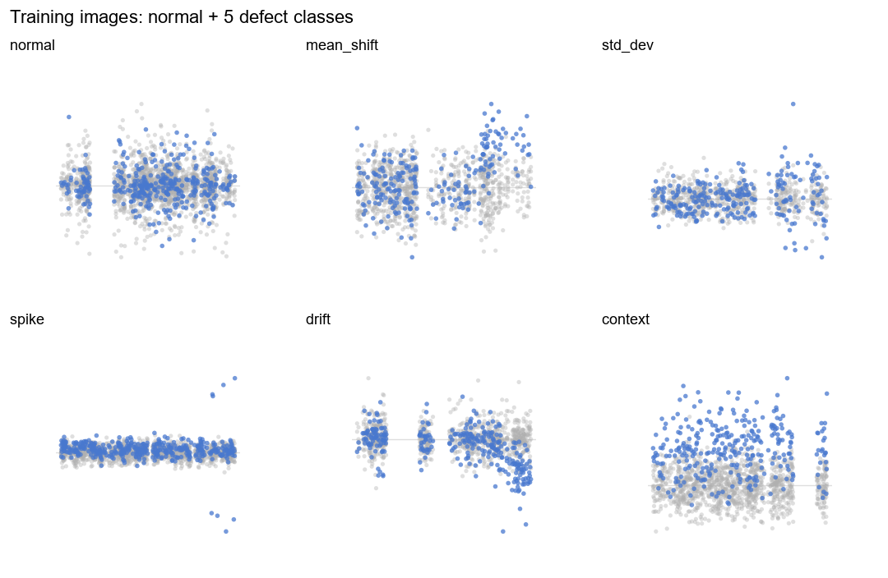

- `label_smoothing` 현재 완료된 조건 중 최선은 `0.15` with `F1=0.9977`, `FN=0.8`, `FP=2.6`.
- `abnormal_weight` 현재 완료된 조건 중 최선은 `1.5` with `F1=0.9979`, `FN=1.2`, `FP=2`.
- `stochastic_depth` 현재 완료된 조건 중 최선은 `0.1` with `F1=0.9975`, `FN=1.2`, `FP=2.6`.
- `GC` 넓은 양호 구간이 유지되고 있으며 완료 조건 중 현재 총 오류가 가장 낮은 쪽은 대략 `1.25` with `F1=0.9975`, `FN=1`, `FP=2.8`. 미완료 값은 본 표에서 제외했습니다.
- `color`는 현재 유효한 비교가 baseline vs c01뿐입니다: `c01 0.9971 / FN 0.6 / FP 3.8`. c02/c03는 생성 이미지가 의도와 달라 재생성이 필요합니다.
- `normal_ratio`: 현재 ref 기준 sweep에서는 3000~3500 구간이 좋아 보이지만, optimized-v11 sweep을 같이 보면 normal_ratio 증가가 항상 개선을 만들지는 않습니다.

## 임시 황금 레시피

_아직 one-factor evidence 단계입니다. round-2 종료 후 joint combo validation이 필요합니다._

| axis | selected value | F1 | FN | FP | status |
| --- | ---: | ---: | ---: | ---: | --- |
| `normal_ratio` | `3300` | 0.9973 | 2.4 | 1.6 | provisional |
| `gc` | `1.25` | 0.9975 | 1 | 2.8 | provisional |
| `label_smoothing` | `0.15` | 0.9977 | 0.8 | 2.6 | provisional |
| `stochastic_depth` | `0.1` | 0.9975 | 1.2 | 2.6 | provisional |
| `focal_gamma` | `0.5` | 0.9969 | 2.8 | 1.8 | provisional |
| `abnormal_weight` | `1.5` | 0.9979 | 1.2 | 2 | provisional |
| `ema` | `0.99` | 0.9972 | 1 | 3.2 | provisional |
| `allow_tie_save` | `on` | 0.9974 | 2.2 | 1.8 | provisional |

## Logical Member Attribution Example

같은 context chart를 member별 target 이미지로 확장합니다. 불량 member를 target으로 만든 이미지만 anomaly class이고, 양호 member를 target으로 만든 이미지는 normal class입니다.

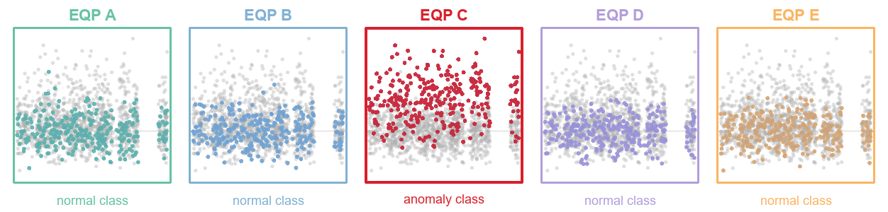

즉 family 전체 이상 감지가 아니라, highlight 된 member 단위로 label을 부여하는 학습 예시입니다.

## 남은 Round-2 확인 항목

- `label_smoothing = 0.125`: `0/5` 완료
- `label_smoothing = 0.175`: `0/5` 완료
- `stochastic_depth = 0.15`: `0/5` 완료
- `focal_gamma = 1`: `0/5` 완료
- `abnormal_weight = 1.2`: `0/5` 완료
- `ema = 0.995`: `0/5` 완료

## 플롯 목록

- `normal_ratio`: [normal_ratio.png](plots/normal_ratio.png)
- `per_class`: [per_class.png](plots/per_class.png)
- `lr`: [lr.png](plots/lr.png)
- `lr` learning-rate schedule: [lr_lr_schedule.png](plots/lr_lr_schedule.png)
- `warmup`: [warmup.png](plots/warmup.png)
- `warmup` learning-rate schedule: [warmup_lr_schedule.png](plots/warmup_lr_schedule.png)
- `gc`: [gc.png](plots/gc.png)
- `weight_decay`: [weight_decay.png](plots/weight_decay.png)
- `smoothing`: [smoothing.png](plots/smoothing.png)
- `label_smoothing`: [label_smoothing.png](plots/label_smoothing.png)
- `stochastic_depth`: [stochastic_depth.png](plots/stochastic_depth.png)
- `focal_gamma`: [focal_gamma.png](plots/focal_gamma.png)
- `abnormal_weight`: [abnormal_weight.png](plots/abnormal_weight.png)
- `ema`: [ema.png](plots/ema.png)
- `color`: [color.png](plots/color.png)
- `allow_tie_save`: [allow_tie_save.png](plots/allow_tie_save.png)

## normal_ratio

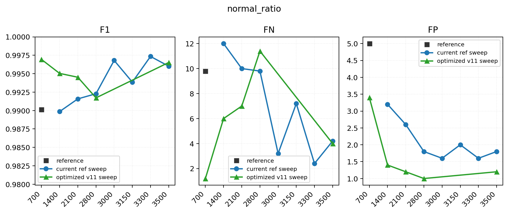

| condition | seeds | F1 | ΔF1 | FN | ΔFN | FP | ΔFP | status |
| --- | ---: | ---: | ---: | ---: | ---: | ---: | ---: | --- |
| 700 | 5/5 | 0.9955 | 0 | 4.4 | 0 | 2.4 | 0 | 기준 |
| 1400 | 5/5 | 0.9899 | -0.0056 | 12 | +7.6 | 3.2 | +0.8 | 완료 |
| 2100 | 5/5 | 0.9916 | -0.0039 | 10 | +5.6 | 2.6 | +0.2 | 완료 |
| 2800 | 5/5 | 0.9923 | -0.0032 | 9.8 | +5.4 | 1.8 | -0.6 | 완료 |
| 3000 | 5/5 | 0.9968 | +0.0013 | 3.2 | -1.2 | 1.6 | -0.8 | 완료 |
| 3150 | 5/5 | 0.9939 | -0.0016 | 7.2 | +2.8 | 2 | -0.4 | 완료 |
| 3300 | 5/5 | 0.9973 | +0.0019 | 2.4 | -2 | 1.6 | -0.8 | 완료 |
| 3500 | 5/5 | 0.9960 | +0.0005 | 4.2 | -0.2 | 1.8 | -0.6 | 완료 |

### optimized-v11 normal_ratio comparison

이미 성능이 최적화된 v11 조건에서는 normal_ratio를 키워도 단조 개선되지 않습니다. 이 표는 normal 수 증가 효과가 데이터/학습 상태에 의존하며, 무조건적인 scale-up claim은 안 된다는 근거입니다.

| condition | seeds | F1 | ΔF1 vs opt700 | FN | ΔFN vs opt700 | FP | ΔFP vs opt700 | status |
| --- | ---: | ---: | ---: | ---: | ---: | ---: | ---: | --- |
| 700 | 5/5 | 0.9969 | 0 | 1.2 | 0 | 3.4 | 0 | 기준 |
| 1400 | 5/5 | 0.9950 | -0.0019 | 6 | +4.8 | 1.4 | -2 | 완료 |
| 2100 | 5/5 | 0.9945 | -0.0024 | 7 | +5.8 | 1.2 | -2.2 | 완료 |
| 2800 | 5/5 | 0.9917 | -0.0052 | 11.4 | +10.2 | 1 | -2.4 | 완료 |
| 3500 | 5/5 | 0.9965 | -0.0004 | 4 | +2.8 | 1.2 | -2.2 | 완료 |

## per_class

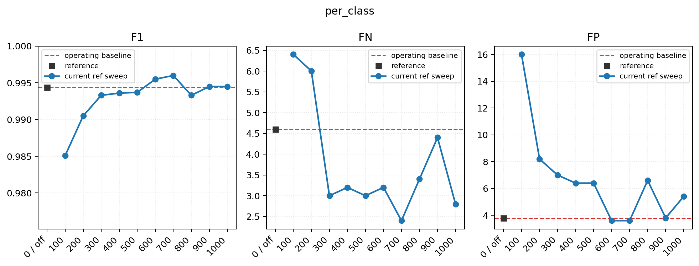

| condition | seeds | F1 | ΔF1 | FN | ΔFN | FP | ΔFP | status |
| --- | ---: | ---: | ---: | ---: | ---: | ---: | ---: | --- |
| 0 / off | 5/5 | 0.9955 | 0 | 4.4 | 0 | 2.4 | 0 | 기준 |
| 100 | 5/5 | 0.9921 | -0.0033 | 5.8 | +1.4 | 6 | +3.6 | 완료 |
| 200 | 5/5 | 0.9948 | -0.0007 | 5.8 | +1.4 | 2 | -0.4 | 완료 |
| 300 | 5/5 | 0.9955 | -0 | 3.8 | -0.6 | 3 | +0.6 | 완료 |
| 400 | 5/5 | 0.9953 | -0.0001 | 4.6 | +0.2 | 2.4 | 0 | 완료 |
| 500 | 5/5 | 0.9957 | +0.0003 | 4.8 | +0.4 | 1.6 | -0.8 | 완료 |
| 600 | 5/5 | 0.9960 | +0.0005 | 4 | -0.4 | 2 | -0.4 | 완료 |
| 700 | 5/5 | 0.9945 | -0.0009 | 6.6 | +2.2 | 1.6 | -0.8 | 완료 |
| 800 | 5/5 | 0.9968 | +0.0013 | 2.6 | -1.8 | 2.2 | -0.2 | 완료 |
| 900 | 5/5 | 0.9937 | -0.0017 | 7.4 | +3 | 2 | -0.4 | 완료 |
| 1000 | 5/5 | 0.9957 | +0.0003 | 4.8 | +0.4 | 1.6 | -0.8 | 완료 |

## LR

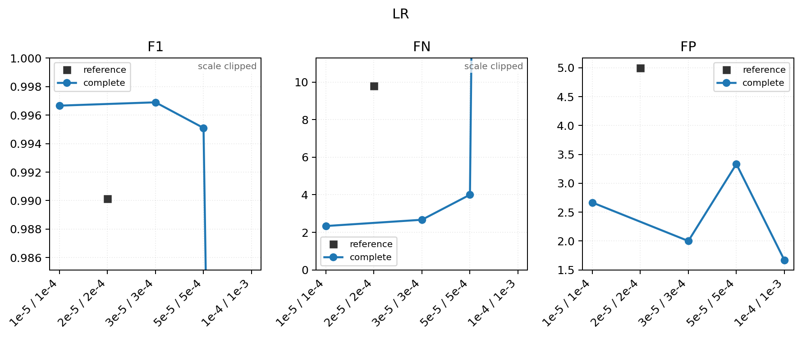

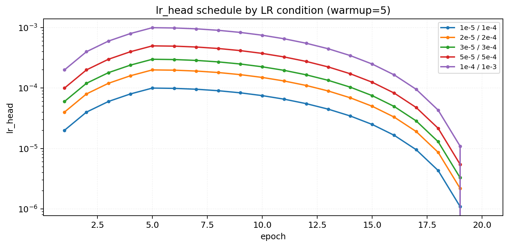

| condition | seeds | F1 | ΔF1 | FN | ΔFN | FP | ΔFP | status |
| --- | ---: | ---: | ---: | ---: | ---: | ---: | ---: | --- |
| 1e-5 / 1e-4 bb/head=1e-5 / 1e-4 | 3/3 | 0.9967 | +0.0012 | 2.333 | -2.067 | 2.667 | +0.267 | 완료 |
| 2e-5 / 2e-4 bb/head=2e-5 / 2e-4 | 5/5 | 0.9955 | 0 | 4.4 | 0 | 2.4 | 0 | 기준 |
| 3e-5 / 3e-4 bb/head=3e-5 / 3e-4 | 3/3 | 0.9969 | +0.0014 | 2.667 | -1.733 | 2 | -0.4 | 완료 |
| 5e-5 / 5e-4 bb/head=5e-5 / 5e-4 | 3/3 | 0.9951 | -0.0004 | 4 | -0.4 | 3.333 | +0.933 | 완료 |
| 1e-4 / 1e-3 bb/head=1e-4 / 1e-3 | 3/3 | 0.7767 | -0.2188 | 250 | +245.6 | 1.667 | -0.733 | 완료 |

## warmup

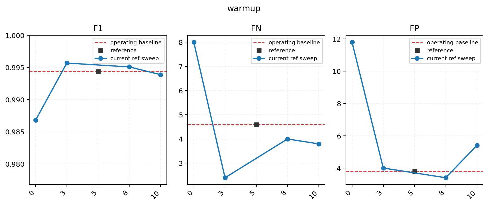

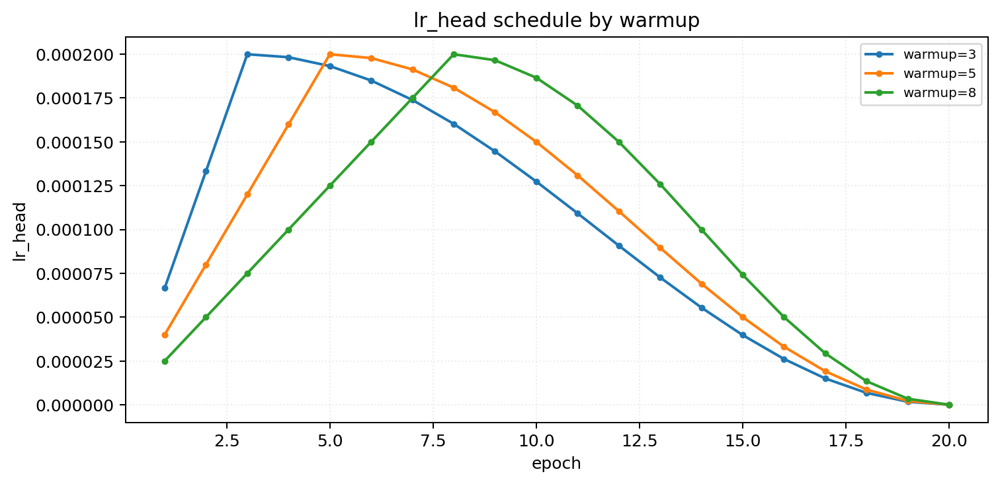

| condition | seeds | F1 | ΔF1 | FN | ΔFN | FP | ΔFP | status |
| --- | ---: | ---: | ---: | ---: | ---: | ---: | ---: | --- |
| warmup=3 lr=2e-5/2e-4 | 3/3 | 0.9964 | +0.001 | 3.333 | -1.067 | 2 | -0.4 | 완료 |
| warmup=5 lr=2e-5/2e-4 | 5/5 | 0.9955 | 0 | 4.4 | 0 | 2.4 | 0 | 기준 |
| warmup=8 lr=2e-5/2e-4 | 3/3 | 0.9940 | -0.0015 | 6.667 | +2.267 | 2.333 | -0.067 | 완료 |

## GC

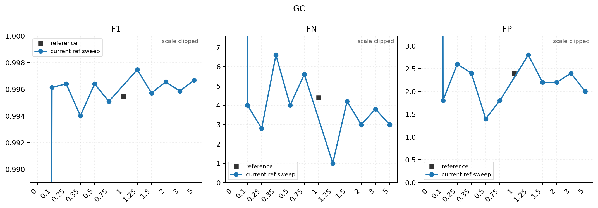

| condition | seeds | F1 | ΔF1 | FN | ΔFN | FP | ΔFP | status |
| --- | ---: | ---: | ---: | ---: | ---: | ---: | ---: | --- |
| 0 | 3/3 | 0.3626 | -0.6328 | 478.667 | +474.267 | 253.333 | +250.933 | 완료 |
| 0.1 | 5/5 | 0.9961 | +0.0007 | 4 | -0.4 | 1.8 | -0.6 | 완료 |
| 0.25 | 5/5 | 0.9964 | +0.0009 | 2.8 | -1.6 | 2.6 | +0.2 | 완료 |
| 0.35 | 5/5 | 0.9940 | -0.0015 | 6.6 | +2.2 | 2.4 | 0 | 완료 |
| 0.5 | 5/5 | 0.9964 | +0.0009 | 4 | -0.4 | 1.4 | -1 | 완료 |
| 0.75 | 5/5 | 0.9951 | -0.0004 | 5.6 | +1.2 | 1.8 | -0.6 | 완료 |
| 1 | 5/5 | 0.9955 | 0 | 4.4 | 0 | 2.4 | 0 | 기준 |
| 1.25 | 5/5 | 0.9975 | +0.002 | 1 | -3.4 | 2.8 | +0.4 | 완료 |
| 1.5 | 5/5 | 0.9957 | +0.0002 | 4.2 | -0.2 | 2.2 | -0.2 | 완료 |
| 2 | 5/5 | 0.9965 | +0.0011 | 3 | -1.4 | 2.2 | -0.2 | 완료 |
| 3 | 5/5 | 0.9959 | +0.0004 | 3.8 | -0.6 | 2.4 | 0 | 완료 |
| 5 | 5/5 | 0.9967 | +0.0012 | 3 | -1.4 | 2 | -0.4 | 완료 |

## weight_decay

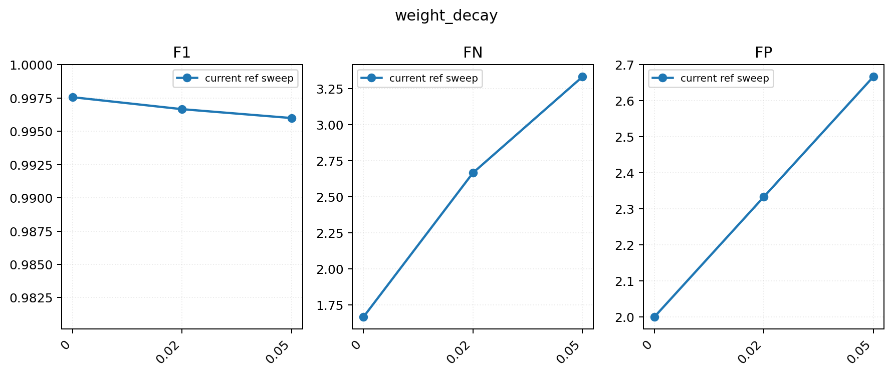

| condition | seeds | F1 | ΔF1 | FN | ΔFN | FP | ΔFP | status |
| --- | ---: | ---: | ---: | ---: | ---: | ---: | ---: | --- |
| 0 | 3/3 | 0.9976 | +0.0021 | 1.667 | -2.733 | 2 | -0.4 | 완료 |
| 0.01 | 5/5 | 0.9955 | 0 | 4.4 | 0 | 2.4 | 0 | 기준 |
| 0.02 | 3/3 | 0.9967 | +0.0012 | 2.667 | -1.733 | 2.333 | -0.067 | 완료 |
| 0.05 | 3/3 | 0.9960 | +0.0005 | 3.333 | -1.067 | 2.667 | +0.267 | 완료 |

## smoothing

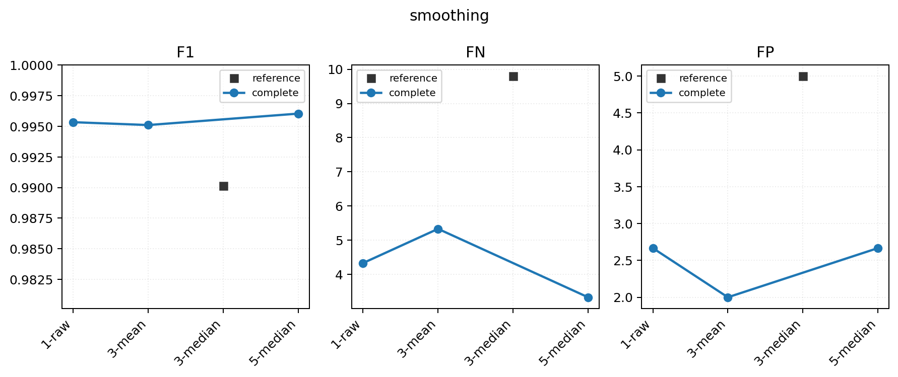

| condition | seeds | F1 | ΔF1 | FN | ΔFN | FP | ΔFP | status |
| --- | ---: | ---: | ---: | ---: | ---: | ---: | ---: | --- |
| 1-raw | 3/3 | 0.9953 | -0.0001 | 4.333 | -0.067 | 2.667 | +0.267 | 완료 |
| 3-mean | 3/3 | 0.9951 | -0.0004 | 5.333 | +0.933 | 2 | -0.4 | 완료 |
| 3-median | 5/5 | 0.9955 | 0 | 4.4 | 0 | 2.4 | 0 | 기준 |
| 5-median | 3/3 | 0.9960 | +0.0006 | 3.333 | -1.067 | 2.667 | +0.267 | 완료 |

## label_smoothing

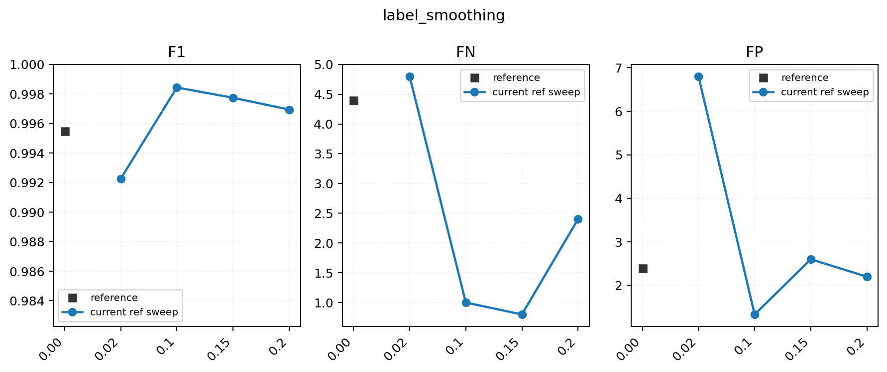

| condition | seeds | F1 | ΔF1 | FN | ΔFN | FP | ΔFP | status |
| --- | ---: | ---: | ---: | ---: | ---: | ---: | ---: | --- |
| 0.00 | 5/5 | 0.9955 | 0 | 4.4 | 0 | 2.4 | 0 | 기준 |
| 0.02 | 5/5 | 0.9923 | -0.0032 | 4.8 | +0.4 | 6.8 | +4.4 | 완료 |
| 0.1 | 3/3 | 0.9984 | +0.003 | 1 | -3.4 | 1.333 | -1.067 | 완료 |
| 0.15 | 5/5 | 0.9977 | +0.0023 | 0.8 | -3.6 | 2.6 | +0.2 | 완료 |
| 0.2 | 5/5 | 0.9969 | +0.0015 | 2.4 | -2 | 2.2 | -0.2 | 완료 |

## stochastic_depth

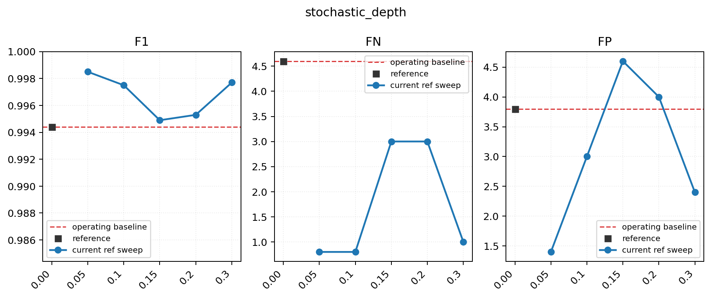

| condition | seeds | F1 | ΔF1 | FN | ΔFN | FP | ΔFP | status |
| --- | ---: | ---: | ---: | ---: | ---: | ---: | ---: | --- |
| 0.00 | 5/5 | 0.9955 | 0 | 4.4 | 0 | 2.4 | 0 | 기준 |
| 0.05 | 5/5 | 0.9949 | -0.0005 | 5.6 | +1.2 | 2 | -0.4 | 완료 |
| 0.1 | 5/5 | 0.9975 | +0.002 | 1.2 | -3.2 | 2.6 | +0.2 | 완료 |
| 0.2 | 3/3 | 0.9967 | +0.0012 | 3 | -1.4 | 2 | -0.4 | 완료 |
| 0.3 | 5/5 | 0.9973 | +0.0018 | 1.8 | -2.6 | 2.2 | -0.2 | 완료 |

## focal_gamma

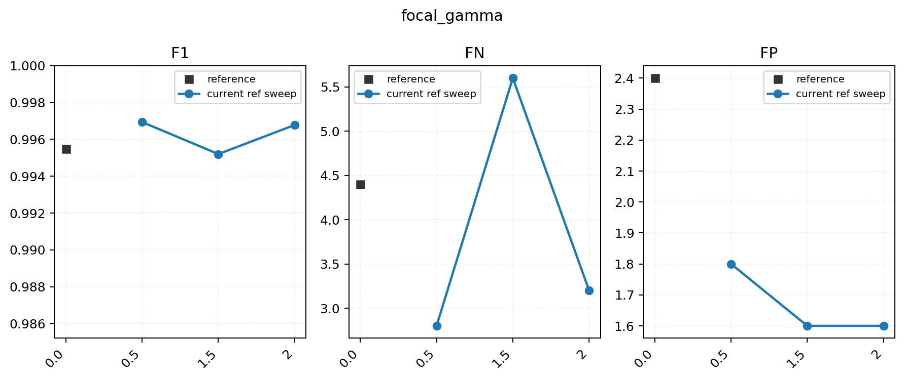

| condition | seeds | F1 | ΔF1 | FN | ΔFN | FP | ΔFP | status |
| --- | ---: | ---: | ---: | ---: | ---: | ---: | ---: | --- |
| 0.0 | 5/5 | 0.9955 | 0 | 4.4 | 0 | 2.4 | 0 | 기준 |
| 0.5 | 5/5 | 0.9969 | +0.0015 | 2.8 | -1.6 | 1.8 | -0.6 | 완료 |
| 1.5 | 5/5 | 0.9952 | -0.0003 | 5.6 | +1.2 | 1.6 | -0.8 | 완료 |
| 2 | 5/5 | 0.9968 | +0.0013 | 3.2 | -1.2 | 1.6 | -0.8 | 완료 |

## abnormal_weight

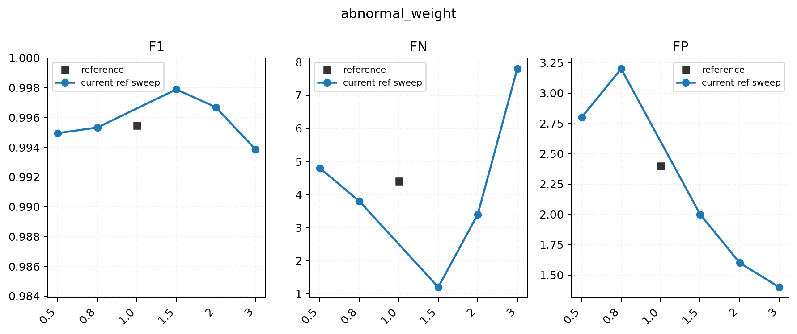

| condition | seeds | F1 | ΔF1 | FN | ΔFN | FP | ΔFP | status |
| --- | ---: | ---: | ---: | ---: | ---: | ---: | ---: | --- |
| 0.5 | 5/5 | 0.9949 | -0.0005 | 4.8 | +0.4 | 2.8 | +0.4 | 완료 |
| 0.8 | 5/5 | 0.9953 | -0.0002 | 3.8 | -0.6 | 3.2 | +0.8 | 완료 |
| 1.0 | 5/5 | 0.9955 | 0 | 4.4 | 0 | 2.4 | 0 | 기준 |
| 1.5 | 5/5 | 0.9979 | +0.0024 | 1.2 | -3.2 | 2 | -0.4 | 완료 |
| 2 | 5/5 | 0.9967 | +0.0012 | 3.4 | -1 | 1.6 | -0.8 | 완료 |
| 3 | 5/5 | 0.9939 | -0.0016 | 7.8 | +3.4 | 1.4 | -1 | 완료 |

## EMA

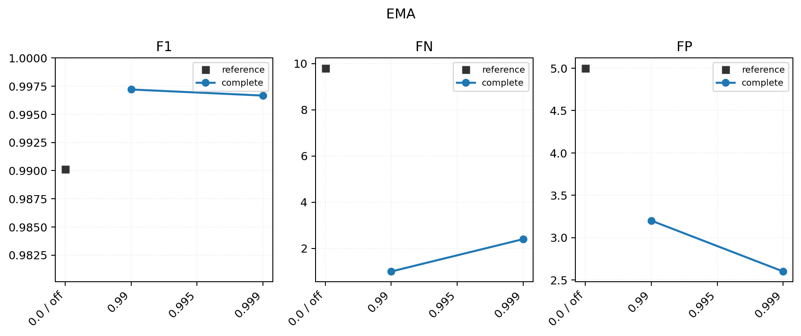

| condition | seeds | F1 | ΔF1 | FN | ΔFN | FP | ΔFP | status |
| --- | ---: | ---: | ---: | ---: | ---: | ---: | ---: | --- |
| 0.0 / off | 5/5 | 0.9955 | 0 | 4.4 | 0 | 2.4 | 0 | 기준 |
| 0.99 | 5/5 | 0.9972 | +0.0017 | 1 | -3.4 | 3.2 | +0.8 | 완료 |
| 0.999 | 5/5 | 0.9967 | +0.0012 | 2.4 | -2 | 2.6 | +0.2 | 완료 |

## color

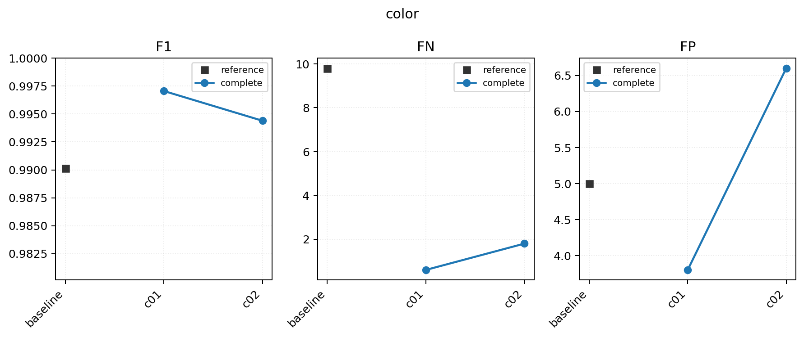

조건 설명:

- `baseline`: trend blue `#4878CF`, fleet alpha `0.4`
- `c01`: trend red `#E43320`, fleet alpha `0.4`
- `c02`: trend blue `#4878CF`, fleet alpha `0.15`
- `c03`: trend red `#E43320`, fleet alpha `0.15`

조건별 대표 sample:

| baseline | c01 | c02 | c03 |
| --- | --- | --- | --- |
| 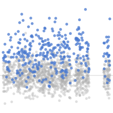 | 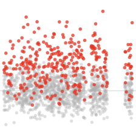 |  | 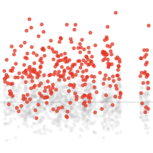 |

| condition | seeds | F1 | ΔF1 | FN | ΔFN | FP | ΔFP | status |
| --- | ---: | ---: | ---: | ---: | ---: | ---: | ---: | --- |
| baseline | 5/5 | 0.9955 | 0 | 4.4 | 0 | 2.4 | 0 | 기준 |
| c01 | 5/5 | 0.9971 | +0.0016 | 0.6 | -3.8 | 3.8 | +1.4 | 완료 |

## allow_tie_save

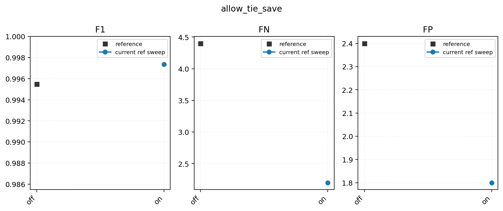

| condition | seeds | F1 | ΔF1 | FN | ΔFN | FP | ΔFP | status |
| --- | ---: | ---: | ---: | ---: | ---: | ---: | ---: | --- |
| off | 5/5 | 0.9955 | 0 | 4.4 | 0 | 2.4 | 0 | 기준 |
| on | 5/5 | 0.9974 | +0.0019 | 2.2 | -2.2 | 1.8 | -0.6 | 완료 |
