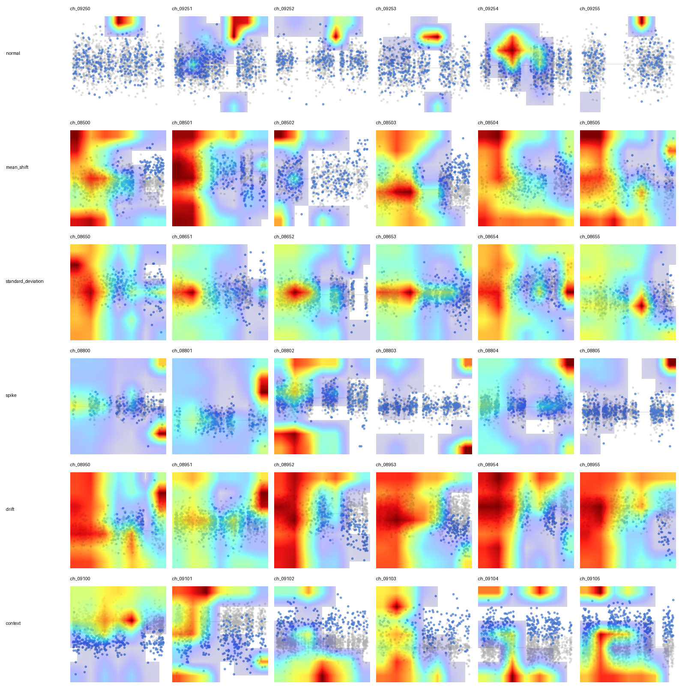
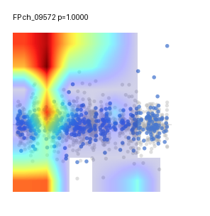

# 실험 요약

_자동 갱신 시각: `2026-04-29T06:03:42+09:00`._

## 실험 방식

- 같은 baseline에서 한 번에 하나의 축만 바꾸는 strict one-factor 실험입니다.
- 기본 seed는 `42, 1, 2, 3, 4`이고, 성능은 `F1`, `FN`, `FP`, 완료 seed 수로 봅니다.
- 서버 rawbase 기준선은 `fresh0412_v11_refcheck_raw_n700`입니다. rawbase main sweep은 `grad_clip=0.0`, `smooth_window=1`, `label_smoothing=0.0`, `NT=0.9`로 맞춥니다.
- 서버 queue는 summary 축 기준으로 `LR`, `warmup`, `normal_ratio`, `per_class`, `label_smoothing`, `stochastic_depth`, `focal_gamma`, `abnormal_weight`, `ema`, `color`, `allow_tie_save`를 먼저 보고 `GC`는 마지막에 봅니다. GC는 5조건만 유지하고, sample-skip은 main sweep에 섞지 않고 별도 1-run으로만 봅니다.

## 성능 요약

| experiment | basis | seeds/runs | F1 | FN | FP | note |
| --- | --- | ---: | ---: | ---: | ---: | --- |
| `fresh0412_v11_refcheck_raw_n700` | raw server baseline | 5/5 | 0.9975 | 1.6 | 2.2 | 현재 서버 기준선 |
| `fresh0412_v11_refcheck_gcsmooth_n700` | matched control | 5/5 | 0.9955 | 4.4 | 2.4 | 아래 기존 strict 표의 delta 기준 |
| `fresh0412_v11_n700_existing` | historical selected ref | 5/5 | 0.9901 | 9.8 | 5.0 | 과거 reference 선택 기록 |
| rawbase round1 live | rawbase history | 39 runs | 0.9981 | 0.641 | 2.256 | 중간 집계, 최종 claim 아님 |
| sample-skip pilot | separate 1-run | 1/1 | 0.9973 | 2 | 2 | main sweep과 분리 |

## Best Known Method

| axis | baseline | BKM value | F1 | FN | FP | status |
| --- | ---: | ---: | ---: | ---: | ---: | --- |
| `normal_ratio` | `700` | `3300` | 0.9973 | 2.4 | 1.6 | single-axis evidence |
| `gc` | `1.0` | `1.25` | 0.9975 | 1 | 2.8 | single-axis evidence |
| `label_smoothing` | `0.00` | `0.15` | 0.9977 | 0.8 | 2.6 | single-axis evidence |
| `stochastic_depth` | `0.00` | `0.1` | 0.9975 | 1.2 | 2.6 | single-axis evidence |
| `focal_gamma` | `0.0` | `0.5` | 0.9969 | 2.8 | 1.8 | single-axis evidence |
| `abnormal_weight` | `1.0` | `1.5` | 0.9979 | 1.2 | 2 | single-axis evidence |
| `ema` | `0.0 / off` | `0.99` | 0.9972 | 1 | 3.2 | single-axis evidence |
| `allow_tie_save` | `off` | `on` | 0.9974 | 2.2 | 1.8 | single-axis evidence |

## 학습 이미지 예시

학습 데이터는 `normal`과 불량 class별 이미지로 구성합니다. 모델 입력은 training image이고, display image는 같은 sample을 사람이 확인하기 쉽게 축/legend/색을 붙인 렌더링입니다.

### Training Image

### Display Image

불량 class는 `mean_shift`, `std_dev`, `spike`, `drift`, `context`처럼 class별로 나뉘며, 각 이미지는 해당 class label로 학습됩니다.

## Logical Member Attribution Example

같은 context chart를 member별 class 판단 이미지로 확장합니다. 불량 member 이미지만 anomaly class이고, 양호 member 이미지는 normal class입니다.

아래 예시는 같은 chart `ch_09100`을 `EQP A`, `EQP B`, `EQP C`, `EQP D`, `EQP E` class 이미지로 펼친 것입니다. 각 EQP의 highlighted trend만 서로 다른 색으로 표시하고, 회색 점들은 같은 context 안의 비교 fleet입니다. class 글자는 normal은 검정, anomaly는 빨강입니다. 이 예시에서는 `EQP C`만 anomaly class이고 `EQP A`, `EQP B`, `EQP D`, `EQP E`는 normal class입니다.

즉 family 전체 이상 감지가 아니라, highlight 된 member 단위로 label을 부여하는 학습 예시입니다.

## Grad-CAM / Postprocess Check

Grad-CAM의 heat는 실제 anomaly 위치가 아니라 `abnormal` logit에 기여한 모델 근거 위치입니다. 넓은 불량은 heat도 넓게 퍼질 수 있고, `spike`처럼 국소 패턴은 더 좁게 잡히는 경향이 있습니다. 좌측 불량과 우측 정상의 대비 때문에 우측에 heat가 생길 수도 있어서, CAM 위치만으로 left/right defect를 판정하지 않습니다.

아래 이미지는 class별 6행, sample별 6열로 원본 trend 이미지 위에 CAM colormap을 반투명으로 얹은 예시입니다. 빨강은 상대적으로 큰 CAM 값이고, 파랑도 함께 표시해서 CAM이 넓게 퍼지는지 확인합니다.

| check | F1 macro | FN | FP | result |
| --- | ---: | ---: | ---: | --- |
| full image baseline | 0.9960 | 5 | 1 | 기준 |
| right-crop rescue | 0.9378 | 0 | 93 | FN 5개는 모두 잡지만 FP가 너무 커짐 |
| Grad-CAM normal rescue, best F1 | 0.9753 | 5 | 32 | FP만 늘고 FN rescue 없음 |
| Grad-CAM normal rescue, best FN | 0.9344 | 0 | 98 | FN은 모두 잡지만 FP가 너무 커짐 |

현재 결론은 Grad-CAM은 설명/검토용으로 두고, 후처리 룰은 바로 적용하지 않습니다. `full=abnormal, right_crop=normal`은 좌측/과거 불량 가능성 검토, `full=abnormal, right_crop=abnormal`은 최근 우측 불량 가능성 검토 정도로만 사용합니다.

### FP Grad-CAM Check

최신 model run의 test FP는 1개입니다. `ch_09572`는 true normal인데 `p_abnormal=0.99995`, right-crop도 `p_abnormal=0.99999`로 abnormal 판정됐습니다. CAM mass는 left 0.730, mid 0.227, right 0.043이라 우측 최근 불량을 본 것이 아니라 좌측/초반의 국소 outlier와 cluster-edge를 강한 abnormal 근거로 본 케이스입니다. 현재 1개 FP만 보면 spike-like 정상 outlier를 spike성 불량으로 오인한 것으로 해석합니다.

## 남은 실험

| scope | 남은 내용 | runs |
| --- | --- | ---: |
| current rawbase queue | `LR`, `warmup` 먼저 실행 후 `normal_ratio`, `per_class`, `label_smoothing 5조건`, `stochastic_depth 5조건`, `focal_gamma 5조건`, `abnormal_weight 5조건`, `ema 5조건`, `color`, `allow_tie_save`, 마지막 `GC 5조건` | pending |
| server needed-only resume | 완료/스킵된 tag는 자동 제외하고 summary 축 잔여만 실행 | pending |
| round2 | rawbase round1 완료 후 결과 기준으로 새 선정 | pending |

## 플롯 목록

- `normal_ratio`: [normal_ratio.png](plots/normal_ratio.png)
- `per_class`: [per_class.png](plots/per_class.png)
- `lr`: [lr.png](plots/lr.png)
- `lr` learning-rate schedule: [lr_lr_schedule.png](plots/lr_lr_schedule.png)
- `warmup`: [warmup.png](plots/warmup.png)
- `warmup` learning-rate schedule: [warmup_lr_schedule.png](plots/warmup_lr_schedule.png)
- `gc`: [gc.png](plots/gc.png)
- `weight_decay`: [weight_decay.png](plots/weight_decay.png)
- `smoothing`: [smoothing.png](plots/smoothing.png)
- `label_smoothing`: [label_smoothing.png](plots/label_smoothing.png)
- `stochastic_depth`: [stochastic_depth.png](plots/stochastic_depth.png)
- `focal_gamma`: [focal_gamma.png](plots/focal_gamma.png)
- `abnormal_weight`: [abnormal_weight.png](plots/abnormal_weight.png)
- `ema`: [ema.png](plots/ema.png)
- `color`: [color.png](plots/color.png)
- `allow_tie_save`: [allow_tie_save.png](plots/allow_tie_save.png)

## normal_ratio

| condition | seeds | F1 | ΔF1 | FN | ΔFN | FP | ΔFP | status |
| --- | ---: | ---: | ---: | ---: | ---: | ---: | ---: | --- |
| 700 | 5/5 | 0.9955 | 0 | 4.4 | 0 | 2.4 | 0 | 기준 |
| 1400 | 5/5 | 0.9899 | -0.0056 | 12 | +7.6 | 3.2 | +0.8 | 완료 |
| 2100 | 5/5 | 0.9916 | -0.0039 | 10 | +5.6 | 2.6 | +0.2 | 완료 |
| 2800 | 5/5 | 0.9923 | -0.0032 | 9.8 | +5.4 | 1.8 | -0.6 | 완료 |
| 3000 | 5/5 | 0.9968 | +0.0013 | 3.2 | -1.2 | 1.6 | -0.8 | 완료 |
| 3150 | 5/5 | 0.9939 | -0.0016 | 7.2 | +2.8 | 2 | -0.4 | 완료 |
| 3300 | 5/5 | 0.9973 | +0.0019 | 2.4 | -2 | 1.6 | -0.8 | 완료 |
| 3500 | 5/5 | 0.9960 | +0.0005 | 4.2 | -0.2 | 1.8 | -0.6 | 완료 |

### optimized-v11 normal_ratio comparison

이미 성능이 최적화된 v11 조건에서는 normal_ratio를 키워도 단조 개선되지 않습니다. 이 표는 normal 수 증가 효과가 데이터/학습 상태에 의존하며, 무조건적인 scale-up claim은 안 된다는 근거입니다.

| condition | seeds | F1 | ΔF1 vs opt700 | FN | ΔFN vs opt700 | FP | ΔFP vs opt700 | status |
| --- | ---: | ---: | ---: | ---: | ---: | ---: | ---: | --- |
| 700 | 5/5 | 0.9969 | 0 | 1.2 | 0 | 3.4 | 0 | 기준 |
| 1400 | 5/5 | 0.9950 | -0.0019 | 6 | +4.8 | 1.4 | -2 | 완료 |
| 2100 | 5/5 | 0.9945 | -0.0024 | 7 | +5.8 | 1.2 | -2.2 | 완료 |
| 2800 | 5/5 | 0.9917 | -0.0052 | 11.4 | +10.2 | 1 | -2.4 | 완료 |
| 3500 | 5/5 | 0.9965 | -0.0004 | 4 | +2.8 | 1.2 | -2.2 | 완료 |

## per_class

| condition | seeds | F1 | ΔF1 | FN | ΔFN | FP | ΔFP | status |
| --- | ---: | ---: | ---: | ---: | ---: | ---: | ---: | --- |
| 0 / off | 5/5 | 0.9955 | 0 | 4.4 | 0 | 2.4 | 0 | 기준 |
| 100 | 5/5 | 0.9921 | -0.0033 | 5.8 | +1.4 | 6 | +3.6 | 완료 |
| 200 | 5/5 | 0.9948 | -0.0007 | 5.8 | +1.4 | 2 | -0.4 | 완료 |
| 300 | 5/5 | 0.9955 | -0 | 3.8 | -0.6 | 3 | +0.6 | 완료 |
| 400 | 5/5 | 0.9953 | -0.0001 | 4.6 | +0.2 | 2.4 | 0 | 완료 |
| 500 | 5/5 | 0.9957 | +0.0003 | 4.8 | +0.4 | 1.6 | -0.8 | 완료 |
| 600 | 5/5 | 0.9960 | +0.0005 | 4 | -0.4 | 2 | -0.4 | 완료 |
| 700 | 5/5 | 0.9945 | -0.0009 | 6.6 | +2.2 | 1.6 | -0.8 | 완료 |
| 800 | 5/5 | 0.9968 | +0.0013 | 2.6 | -1.8 | 2.2 | -0.2 | 완료 |
| 900 | 5/5 | 0.9937 | -0.0017 | 7.4 | +3 | 2 | -0.4 | 완료 |
| 1000 | 5/5 | 0.9957 | +0.0003 | 4.8 | +0.4 | 1.6 | -0.8 | 완료 |

## LR

| condition | seeds | F1 | ΔF1 | FN | ΔFN | FP | ΔFP | status |
| --- | ---: | ---: | ---: | ---: | ---: | ---: | ---: | --- |
| 1e-5 / 1e-4 bb/head=1e-5 / 1e-4 | 3/3 | 0.9967 | +0.0012 | 2.333 | -2.067 | 2.667 | +0.267 | 완료 |
| 2e-5 / 2e-4 bb/head=2e-5 / 2e-4 | 5/5 | 0.9955 | 0 | 4.4 | 0 | 2.4 | 0 | 기준 |
| 3e-5 / 3e-4 bb/head=3e-5 / 3e-4 | 3/3 | 0.9969 | +0.0014 | 2.667 | -1.733 | 2 | -0.4 | 완료 |
| 5e-5 / 5e-4 bb/head=5e-5 / 5e-4 | 3/3 | 0.9951 | -0.0004 | 4 | -0.4 | 3.333 | +0.933 | 완료 |
| 1e-4 / 1e-3 bb/head=1e-4 / 1e-3 | 3/3 | 0.7767 | -0.2188 | 250 | +245.6 | 1.667 | -0.733 | 완료 |

## warmup

| condition | seeds | F1 | ΔF1 | FN | ΔFN | FP | ΔFP | status |
| --- | ---: | ---: | ---: | ---: | ---: | ---: | ---: | --- |
| warmup=3 lr=2e-5/2e-4 | 3/3 | 0.9964 | +0.001 | 3.333 | -1.067 | 2 | -0.4 | 완료 |
| warmup=5 lr=2e-5/2e-4 | 5/5 | 0.9955 | 0 | 4.4 | 0 | 2.4 | 0 | 기준 |
| warmup=8 lr=2e-5/2e-4 | 3/3 | 0.9940 | -0.0015 | 6.667 | +2.267 | 2.333 | -0.067 | 완료 |

## GC

| condition | seeds | F1 | ΔF1 | FN | ΔFN | FP | ΔFP | status |
| --- | ---: | ---: | ---: | ---: | ---: | ---: | ---: | --- |
| 0 | 3/3 | 0.3626 | -0.6328 | 478.667 | +474.267 | 253.333 | +250.933 | 완료 |
| 0.1 | 5/5 | 0.9961 | +0.0007 | 4 | -0.4 | 1.8 | -0.6 | 완료 |
| 0.25 | 5/5 | 0.9964 | +0.0009 | 2.8 | -1.6 | 2.6 | +0.2 | 완료 |
| 0.35 | 5/5 | 0.9940 | -0.0015 | 6.6 | +2.2 | 2.4 | 0 | 완료 |
| 0.5 | 5/5 | 0.9964 | +0.0009 | 4 | -0.4 | 1.4 | -1 | 완료 |
| 0.75 | 5/5 | 0.9951 | -0.0004 | 5.6 | +1.2 | 1.8 | -0.6 | 완료 |
| 1 | 5/5 | 0.9955 | 0 | 4.4 | 0 | 2.4 | 0 | 기준 |
| 1.25 | 5/5 | 0.9975 | +0.002 | 1 | -3.4 | 2.8 | +0.4 | 완료 |
| 1.5 | 5/5 | 0.9957 | +0.0002 | 4.2 | -0.2 | 2.2 | -0.2 | 완료 |
| 2 | 5/5 | 0.9965 | +0.0011 | 3 | -1.4 | 2.2 | -0.2 | 완료 |
| 3 | 5/5 | 0.9959 | +0.0004 | 3.8 | -0.6 | 2.4 | 0 | 완료 |
| 5 | 5/5 | 0.9967 | +0.0012 | 3 | -1.4 | 2 | -0.4 | 완료 |

## weight_decay

| condition | seeds | F1 | ΔF1 | FN | ΔFN | FP | ΔFP | status |
| --- | ---: | ---: | ---: | ---: | ---: | ---: | ---: | --- |
| 0 | 3/3 | 0.9976 | +0.0021 | 1.667 | -2.733 | 2 | -0.4 | 완료 |
| 0.01 | 5/5 | 0.9955 | 0 | 4.4 | 0 | 2.4 | 0 | 기준 |
| 0.02 | 3/3 | 0.9967 | +0.0012 | 2.667 | -1.733 | 2.333 | -0.067 | 완료 |
| 0.05 | 3/3 | 0.9960 | +0.0005 | 3.333 | -1.067 | 2.667 | +0.267 | 완료 |

## smoothing

| condition | seeds | F1 | ΔF1 | FN | ΔFN | FP | ΔFP | status |
| --- | ---: | ---: | ---: | ---: | ---: | ---: | ---: | --- |
| 1-raw | 3/3 | 0.9953 | -0.0001 | 4.333 | -0.067 | 2.667 | +0.267 | 완료 |
| 3-mean | 3/3 | 0.9951 | -0.0004 | 5.333 | +0.933 | 2 | -0.4 | 완료 |
| 3-median | 5/5 | 0.9955 | 0 | 4.4 | 0 | 2.4 | 0 | 기준 |
| 5-median | 3/3 | 0.9960 | +0.0006 | 3.333 | -1.067 | 2.667 | +0.267 | 완료 |

## label_smoothing

| condition | seeds | F1 | ΔF1 | FN | ΔFN | FP | ΔFP | status |
| --- | ---: | ---: | ---: | ---: | ---: | ---: | ---: | --- |
| 0.00 | 5/5 | 0.9955 | 0 | 4.4 | 0 | 2.4 | 0 | 기준 |
| 0.02 | 5/5 | 0.9923 | -0.0032 | 4.8 | +0.4 | 6.8 | +4.4 | 완료 |
| 0.1 | 3/3 | 0.9984 | +0.003 | 1 | -3.4 | 1.333 | -1.067 | 완료 |
| 0.15 | 5/5 | 0.9977 | +0.0023 | 0.8 | -3.6 | 2.6 | +0.2 | 완료 |
| 0.2 | 5/5 | 0.9969 | +0.0015 | 2.4 | -2 | 2.2 | -0.2 | 완료 |

## stochastic_depth

| condition | seeds | F1 | ΔF1 | FN | ΔFN | FP | ΔFP | status |
| --- | ---: | ---: | ---: | ---: | ---: | ---: | ---: | --- |
| 0.00 | 5/5 | 0.9955 | 0 | 4.4 | 0 | 2.4 | 0 | 기준 |
| 0.05 | 5/5 | 0.9949 | -0.0005 | 5.6 | +1.2 | 2 | -0.4 | 완료 |
| 0.1 | 5/5 | 0.9975 | +0.002 | 1.2 | -3.2 | 2.6 | +0.2 | 완료 |
| 0.2 | 3/3 | 0.9967 | +0.0012 | 3 | -1.4 | 2 | -0.4 | 완료 |
| 0.3 | 5/5 | 0.9973 | +0.0018 | 1.8 | -2.6 | 2.2 | -0.2 | 완료 |

## focal_gamma

| condition | seeds | F1 | ΔF1 | FN | ΔFN | FP | ΔFP | status |
| --- | ---: | ---: | ---: | ---: | ---: | ---: | ---: | --- |
| 0.0 | 5/5 | 0.9955 | 0 | 4.4 | 0 | 2.4 | 0 | 기준 |
| 0.5 | 5/5 | 0.9969 | +0.0015 | 2.8 | -1.6 | 1.8 | -0.6 | 완료 |
| 1.5 | 5/5 | 0.9952 | -0.0003 | 5.6 | +1.2 | 1.6 | -0.8 | 완료 |
| 2 | 5/5 | 0.9968 | +0.0013 | 3.2 | -1.2 | 1.6 | -0.8 | 완료 |

## abnormal_weight

| condition | seeds | F1 | ΔF1 | FN | ΔFN | FP | ΔFP | status |
| --- | ---: | ---: | ---: | ---: | ---: | ---: | ---: | --- |
| 0.5 | 5/5 | 0.9949 | -0.0005 | 4.8 | +0.4 | 2.8 | +0.4 | 완료 |
| 0.8 | 5/5 | 0.9953 | -0.0002 | 3.8 | -0.6 | 3.2 | +0.8 | 완료 |
| 1.0 | 5/5 | 0.9955 | 0 | 4.4 | 0 | 2.4 | 0 | 기준 |
| 1.5 | 5/5 | 0.9979 | +0.0024 | 1.2 | -3.2 | 2 | -0.4 | 완료 |
| 2 | 5/5 | 0.9967 | +0.0012 | 3.4 | -1 | 1.6 | -0.8 | 완료 |
| 3 | 5/5 | 0.9939 | -0.0016 | 7.8 | +3.4 | 1.4 | -1 | 완료 |

## EMA

| condition | seeds | F1 | ΔF1 | FN | ΔFN | FP | ΔFP | status |
| --- | ---: | ---: | ---: | ---: | ---: | ---: | ---: | --- |
| 0.0 / off | 5/5 | 0.9955 | 0 | 4.4 | 0 | 2.4 | 0 | 기준 |
| 0.99 | 5/5 | 0.9972 | +0.0017 | 1 | -3.4 | 3.2 | +0.8 | 완료 |
| 0.999 | 5/5 | 0.9967 | +0.0012 | 2.4 | -2 | 2.6 | +0.2 | 완료 |

## color

조건 설명:

- `baseline`: trend blue `#4878CF`, fleet alpha `0.4`
- `c01`: trend red `#E43320`, fleet alpha `0.4`
- `c02`: trend blue `#4878CF`, fleet alpha `0.15`
- `c03`: trend red `#E43320`, fleet alpha `0.15`

조건별 대표 sample:

| baseline | c01 | c02 | c03 |
| --- | --- | --- | --- |
|  |  |  |  |

| condition | seeds | F1 | ΔF1 | FN | ΔFN | FP | ΔFP | status |
| --- | ---: | ---: | ---: | ---: | ---: | ---: | ---: | --- |
| baseline | 5/5 | 0.9955 | 0 | 4.4 | 0 | 2.4 | 0 | 기준 |
| c01 | 5/5 | 0.9971 | +0.0016 | 0.6 | -3.8 | 3.8 | +1.4 | 완료 |

## allow_tie_save

| condition | seeds | F1 | ΔF1 | FN | ΔFN | FP | ΔFP | status |
| --- | ---: | ---: | ---: | ---: | ---: | ---: | ---: | --- |
| off | 5/5 | 0.9955 | 0 | 4.4 | 0 | 2.4 | 0 | 기준 |
| on | 5/5 | 0.9974 | +0.0019 | 2.2 | -2.2 | 1.8 | -0.6 | 완료 |

## 운영 스크립트

| task | command | output |
| --- | --- | --- |
| 추론용 이미지 생성 | `python scripts/generate_inference_images.py --timeseries data/timeseries.csv --scenarios data/scenarios.csv --out-dir inference_inputs` | `model_inputs/`, `display/`, `manifest.csv` |
| best model 추론 | `python inference.py --model logs/<run>/best_model.pth` | prediction output |
| normal/abnormal 추가학습 | `python scripts/add_training_from_folders.py --model-run logs/<run> --image-root extra_images --epochs 3 --lr 1e-5 --scheduler cosine` | `logs/addtrain_*/best_model.pth`, `best_info.json`, `history.json`, `confusion_matrix.png` |

추가학습은 기존 `best_model.pth` weight에서 시작하고, LR/scheduler는 추가학습 옵션으로 새로 지정합니다. 추가학습 입력은 모델 입력용 이미지이고, display 이미지는 확인용입니다.
