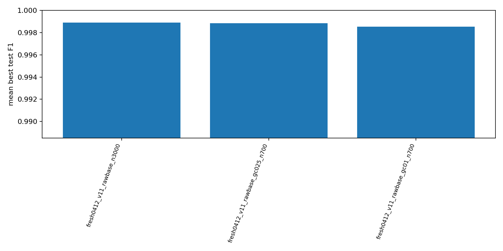
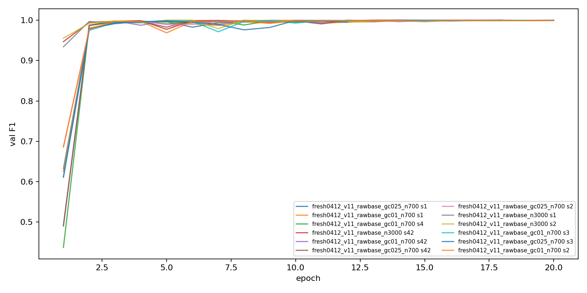
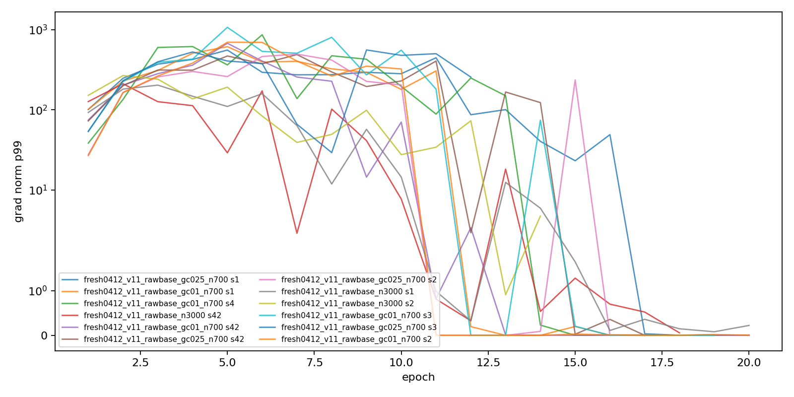

# 실험 요약

_자동 갱신 시각: `2026-04-28T20:37:13+09:00`._

## 현재 진행 상태

- 이 블록은 `scripts/update_live_summary_doc.py`가 controller artifact에서 갱신합니다.
- 서버 rawbase queue 정책: GC는 5개 조건만 유지합니다: `gc01`, `gc025`, `gc05`, `gc15`, `gc50`; sample-skip은 main sweep과 분리합니다.
- raw baseline refcheck: `5/5`, F1 `0.9975`, FN `1.6`, FP `2.2`.
- rawbase round1 aggregate: `12` complete runs, F1 `0.9988`, FN `0.561`, FP `2.139`, decision `continue`.
- rawbase 현재 완료 후보:
  - `fresh0412_v11_rawbase_n3000`: `3/5`, F1 `0.9989`, FN `0.333`, FP `1.667`
  - `fresh0412_v11_rawbase_gc025_n700`: `4/5`, F1 `0.9989`, FN `0.75`, FP `1.75`
  - `fresh0412_v11_rawbase_gc01_n700`: `5/5`, F1 `0.9985`, FN `0.6`, FP `3`
- latest completed rawbase run: `260428_201738_fresh0412_v11_rawbase_n3000_s2_F0.9980_R0.9980` -> F1 `0.998`, FN `0`, FP `3`, epoch `11`.
- sample-skip result: `fresh0412_v11_lossfilter_raw_n700_s42` -> F1 `0.9973`, FN `2`, FP `2`.
- NT 평가는 selected threshold만 남겼고 reporting default는 `NT=0.9`입니다.
- controller/all.sh 로그에서는 tqdm progress bar가 자동 비활성화됩니다.

## Team Agent 운영 계획

- 1단계: raw baseline refcheck 5 seeds는 완료됐고, `validations/server_paper_refcheck_raw_summary.json`을 raw 기준선으로 채택합니다.
- 2단계: rawbase strict round1은 GC 5조건 제한을 적용한 뒤 진행합니다. `bash scripts/sweeps_server/00_all.sh`, `02_round1.sh`, Windows watcher 모두 같은 queue preparation 정책을 씁니다.
- 3단계: raw round1 결과로 round2를 새로 선택합니다. 기존 `paper_strict_single_factor_round2_*` 산출물은 gcsmooth 기준이므로 raw baseline claim에는 직접 재사용하지 않습니다.
- 4단계: sample-skip은 main sweep에 섞지 않고 별도 1-run으로만 비교합니다. 우선순위는 5조건 GC, `normal_ratio`, `label_smoothing`, `abnormal_weight`, `stochastic_depth`, `ema`입니다.

## 결과 해석

- 이번 strict one-factor round에서는 baseline을 고정한 채 `normal_ratio`, `per_class`, `lr`, `warmup`, `gc`, `weight_decay`, `smoothing`, `label_smoothing`, `stochastic_depth`, `focal_gamma`, `abnormal_weight`, `ema`, `color`, `allow_tie_save`를 개별 축으로 확인했습니다.
- 유의미한 최적값 후보가 보이는 축은 `label_smoothing`은 `0.15` 근처에서 가장 강한 개선이 보였고, 너무 낮거나 높으면 FP/FN 균형이 다시 나빠졌습니다; `abnormal_weight`는 `1.5` 근처에서 sweet spot이 보였고, 더 크게 주면 FN이 다시 증가했습니다; `stochastic_depth`는 `0.1` 인근에서 유의미한 개선이 나타났습니다.
- `GC`는 dense sweep이 과하므로 서버 rawbase에서는 5개 조건만 유지합니다. 단일 sharp optimum보다는 넓은 양호 구간으로 해석하는 편이 맞고, 나머지 세부 GC 값은 보조 기록으로만 둡니다.
- 현재로서는 뚜렷한 최적값이 약하거나 추가 확인이 필요한 축은 `focal_gamma`는 여러 값이 비슷해서 뚜렷한 최적값보다는 broad-good 혹은 약한 효과 축에 가깝습니다; `normal_ratio`는 성능이 전반적으로 좋아지는 구간은 보이지만, 현재 점들만으로는 매끈한 단일 sweet spot이라고 단정하기 어렵습니다; `ema`는 baseline 대비 개선은 있으나 강한 최적값 주장을 하기는 아직 어렵습니다.

## 한계와 수정 필요 사항

- 서버 운영 baseline은 raw 기준 `fresh0412_v11_refcheck_raw_n700`로 전환 완료됐습니다. 다만 아래 기존 strict 표와 delta는 아직 완료된 matched control `fresh0412_v11_refcheck_gcsmooth_n700` 기준으로 남아 있으므로, rawbase round1이 쌓이는 대로 raw 기준 표로 재생성해야 합니다.
- 완료된 gcsmooth matched control은 `F1=0.9955`, `FN=4.4`, `FP=2.4`, target band hit `0/5`입니다. FP가 전 seed에서 낮아 기준선이 너무 깨끗하다는 한계가 있습니다.
- `fresh0412_v11_n700_existing`은 historical selected ref로 보존합니다. raw strict one-factor 표와 delta 계산 기준은 `fresh0412_v11_refcheck_raw_n700`로 재생성해야 합니다.
- `label_smoothing=0.0`은 baseline train config에 명시된 no-smoothing 상태입니다. 단, `label_smoothing>0`에서는 loss 구현 경로가 `CrossEntropyLoss(label_smoothing=...)`로 바뀌므로 최종 claim에는 이 구현 차이를 한계로 적어야 합니다.
- 현재 표는 baseline-fixed one-factor evidence만 섞어 보여줍니다. alternate-parent stress, bad-case rescue, logical/per-member 실험은 별도 표로 분리해야 합니다.
- rawbase server queue는 GC 5조건 제한과 sample-skip 분리를 반영한 뒤 재생성해야 합니다. claim 성숙도 카운트는 rawbase round1 완료 후 재계산합니다.
- `stochastic_depth`는 학습 때 일부 residual/drop-path branch를 확률적으로 끄는 regularization입니다. 추론 때는 전체 경로를 쓰며, 모델이 한 경로에 과적합하지 않게 만들어 seed 안정성과 FN/FP 균형이 좋아지는지 보는 축입니다.
- 최종 논문화 전에는 각 축마다 per-seed/worst-seed, history의 val_loss/F1 진동, prediction trend의 반복 FP/FN chart_id, label-or-annotation suspect를 붙여야 합니다.

## 요약

- Active raw baseline: `fresh0412_v11_refcheck_raw_n700` -> `5/5`, F1 `0.9975`, FN `1.6`, FP `2.2`.
- Server queue policy: rawbase round1 keeps only 5 GC conditions and runs sample-skip separately via `scripts/sweeps_server/06_sample_skip.sh`.
- Live rawbase artifact: `12` complete runs, decision `continue`, F1 `0.9988`, FN `0.561`, FP `2.139`.
- Last completed matched control: `fresh0412_v11_refcheck_gcsmooth_n700` -> `F1=0.9955`, `FN=4.4`, `FP=2.4` over `5/5` seeds.
- Historical selected ref: `fresh0412_v11_n700_existing` -> `F1=0.9901`, `FN=9.8`, `FP=5.0`; kept only as reference-selection history.
- 기존 gcsmooth round2 결과는 보존하되, raw claim용 round2는 rawbase round1 결과 뒤 새로 선정합니다.

## Best Known Method

_현재 one-factor evidence 기준 best-known method입니다. round-2 종료 후 joint combo validation이 필요합니다._

| axis | ref value | BKM value | F1 | FN | FP | status |
| --- | ---: | ---: | ---: | ---: | ---: | --- |
| `normal_ratio` | `700` | `3300` | 0.9973 | 2.4 | 1.6 | single-axis evidence |
| `gc` | `0 / off` | `1.25` | 0.9975 | 1 | 2.8 | single-axis evidence |
| `label_smoothing` | `0.00` | `0.15` | 0.9977 | 0.8 | 2.6 | single-axis evidence |
| `stochastic_depth` | `0.00` | `0.1` | 0.9975 | 1.2 | 2.6 | single-axis evidence |
| `focal_gamma` | `0.0` | `0.5` | 0.9969 | 2.8 | 1.8 | single-axis evidence |
| `abnormal_weight` | `1.0` | `1.5` | 0.9979 | 1.2 | 2 | single-axis evidence |
| `ema` | `0.0 / off` | `0.99` | 0.9972 | 1 | 3.2 | single-axis evidence |
| `allow_tie_save` | `off` | `on` | 0.9974 | 2.2 | 1.8 | single-axis evidence |

## Logical Member Attribution Example

같은 context chart를 member별 target 이미지로 확장합니다. 불량 member를 target으로 만든 이미지만 anomaly class이고, 양호 member를 target으로 만든 이미지는 normal class입니다.

즉 family 전체 이상 감지가 아니라, highlight 된 member 단위로 label을 부여하는 학습 예시입니다.

## 남은 Round-2 확인 항목

- `label_smoothing = 0.125`: `0/5` 완료
- `label_smoothing = 0.175`: `0/5` 완료
- `stochastic_depth = 0.15`: `0/5` 완료
- `focal_gamma = 1`: `0/5` 완료
- `abnormal_weight = 1.2`: `0/5` 완료
- `ema = 0.995`: `0/5` 완료

## Rawbase Live Tables And Plots

이 아래 표와 plot은 active raw baseline `fresh0412_v11_refcheck_raw_n700`을 ref/baseline으로 둡니다. 예전 gcsmooth 기준 상세 축 표는 current performance 표에서 제거했습니다.

### Live Plots

- `candidate F1`: [rawbase_live_candidate_f1.png](plots/rawbase_live_candidate_f1.png)
- `val F1 curves`: [rawbase_live_val_f1_curves.png](plots/rawbase_live_val_f1_curves.png)
- `grad p99 curves`: [rawbase_live_grad_p99_curves.png](plots/rawbase_live_grad_p99_curves.png)

### Candidate Table

| candidate | seeds | F1 | dF1 vs raw ref | FN | dFN vs raw ref | FP | dFP vs raw ref | source |
| --- | ---: | ---: | ---: | ---: | ---: | ---: | ---: | --- |
| `fresh0412_v11_refcheck_raw_n700` | 5/5 | 0.9975 | 0 | 1.6 | 0 | 2.2 | 0 | raw ref |
| `fresh0412_v11_rawbase_n3000` | 3/5 | 0.9989 | +0.0014 | 0.333 | -1.267 | 1.667 | -0.533 | rawbase history |
| `fresh0412_v11_rawbase_gc025_n700` | 4/5 | 0.9989 | +0.0014 | 0.75 | -0.85 | 1.75 | -0.45 | rawbase history |
| `fresh0412_v11_rawbase_gc01_n700` | 5/5 | 0.9985 | +0.0011 | 0.6 | -1 | 3 | +0.8 | rawbase history |

### Recent Runs

| tag | seed | F1 | FN | FP | epoch | run dir |
| --- | ---: | ---: | ---: | ---: | ---: | --- |
| `260428_201738_fresh0412_v11_rawbase_n3000_s2_F0.9980_R0.9980` | 2 | 0.998 | 0 | 3 | 11 | `logs\260428_201738_fresh0412_v11_rawbase_n3000_s2_F0.9980_R0.9980` |
| `260428_195221_fresh0412_v11_rawbase_n3000_s1_F0.9987_R0.9987` | 1 | 0.9987 | 1 | 1 | 17 | `logs\260428_195221_fresh0412_v11_rawbase_n3000_s1_F0.9987_R0.9987` |
| `260428_192619_fresh0412_v11_rawbase_n3000_s42_F0.9993_R0.9993` | 42 | 0.9993 | 0 | 1 | 13 | `logs\260428_192619_fresh0412_v11_rawbase_n3000_s42_F0.9993_R0.9993` |
| `260428_191448_fresh0412_v11_rawbase_gc025_n700_s3_F0.9980_R0.9980` | 3 | 0.998 | 2 | 1 | 10 | `logs\260428_191448_fresh0412_v11_rawbase_gc025_n700_s3_F0.9980_R0.9980` |
| `260428_185929_fresh0412_v11_rawbase_gc025_n700_s2_F0.9973_R0.9973` | 2 | 0.9973 | 1 | 3 | 10 | `logs\260428_185929_fresh0412_v11_rawbase_gc025_n700_s2_F0.9973_R0.9973` |
| `260428_184106_fresh0412_v11_rawbase_gc025_n700_s1_F0.9993_R0.9993` | 1 | 0.9993 | 0 | 1 | 20 | `logs\260428_184106_fresh0412_v11_rawbase_gc025_n700_s1_F0.9993_R0.9993` |
| `260428_182613_fresh0412_v11_rawbase_gc025_n700_s42_F0.9987_R0.9987` | 42 | 0.9987 | 0 | 2 | 12 | `logs\260428_182613_fresh0412_v11_rawbase_gc025_n700_s42_F0.9987_R0.9987` |
| `260428_180912_fresh0412_v11_rawbase_gc01_n700_s4_F0.9987_R0.9987` | 4 | 0.9987 | 1 | 1 | 14 | `logs\260428_180912_fresh0412_v11_rawbase_gc01_n700_s4_F0.9987_R0.9987` |
| `260428_175221_fresh0412_v11_rawbase_gc01_n700_s3_F0.9960_R0.9960` | 3 | 0.996 | 2 | 4 | 14 | `logs\260428_175221_fresh0412_v11_rawbase_gc01_n700_s3_F0.9960_R0.9960` |
| `260428_173449_fresh0412_v11_rawbase_gc01_n700_s2_F0.9967_R0.9967` | 2 | 0.9967 | 0 | 5 | 16 | `logs\260428_173449_fresh0412_v11_rawbase_gc01_n700_s2_F0.9967_R0.9967` |
| `260428_171807_fresh0412_v11_rawbase_gc01_n700_s1_F0.9980_R0.9980` | 1 | 0.998 | 0 | 3 | 14 | `logs\260428_171807_fresh0412_v11_rawbase_gc01_n700_s1_F0.9980_R0.9980` |
| `260428_170005_fresh0412_v11_rawbase_gc01_n700_s42_F0.9987_R0.9987` | 42 | 0.9987 | 0 | 2 | 18 | `logs\260428_170005_fresh0412_v11_rawbase_gc01_n700_s42_F0.9987_R0.9987` |

### Historical Tables

예전 `docs/plots/*.png`와 dense one-factor 표는 gcsmooth matched control 기준이므로 current raw performance 표로 쓰지 않습니다. 필요하면 historical appendix로 별도 분리합니다.
