# 실험 결과 종합 요약

생성일: 2026-04-09 · 데이터 출처: `logs/*/best_info.json` 전체 (278 runs)
재생성: `PYTHONIOENCODING=utf-8 python experiment_summary/build_summary.py`
원본 raw: [`data.csv`](data.csv) (278 rows)

---

## 데이터 샘플 (6 클래스)

각 클래스마다 2장: **model_input** (224×224 축 없음, 모델이 실제 보는 입력) + **human_view** (축/legend/title 있는 사람 확인용 display).

### Normal vs 5 불량 (model input — 모델 입력)

| Normal | Mean Shift | Standard Deviation |
|---|---|---|
| 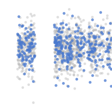 | 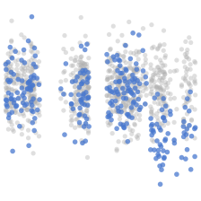 | 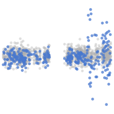 |

| Spike | Drift | Context |
|---|---|---|
| 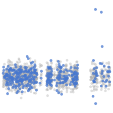 | 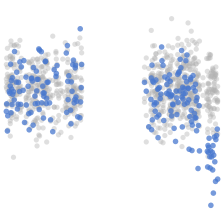 | 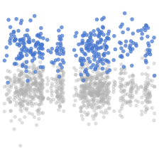 |

### Display (사람 확인용 — 축/legend 포함)

| Normal | Mean Shift | Standard Deviation |
|---|---|---|
| 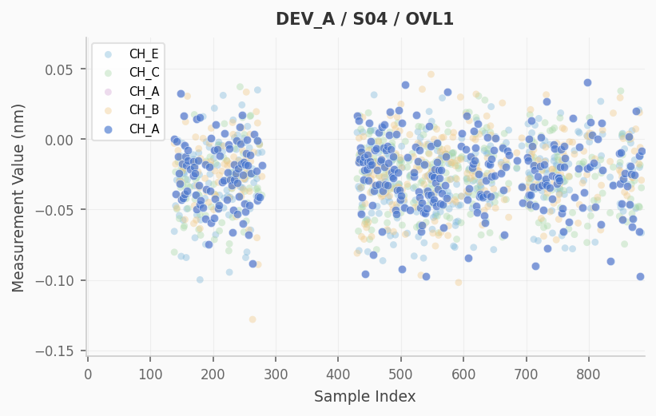 | 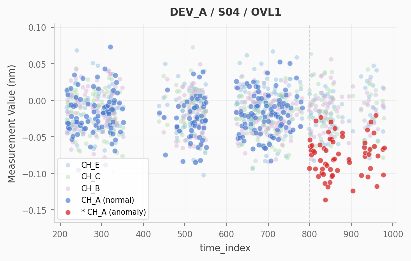 | 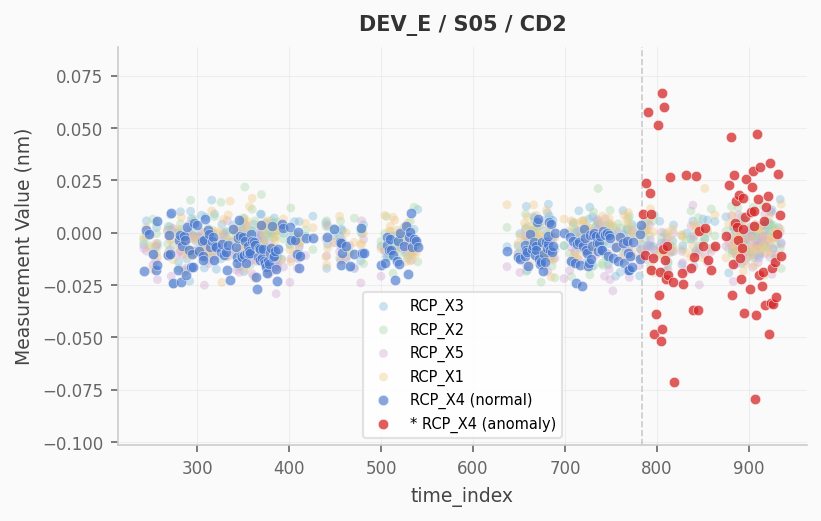 |

| Spike | Drift | Context |
|---|---|---|
| 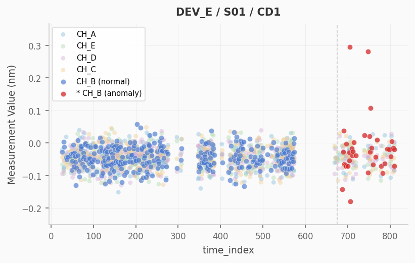 | 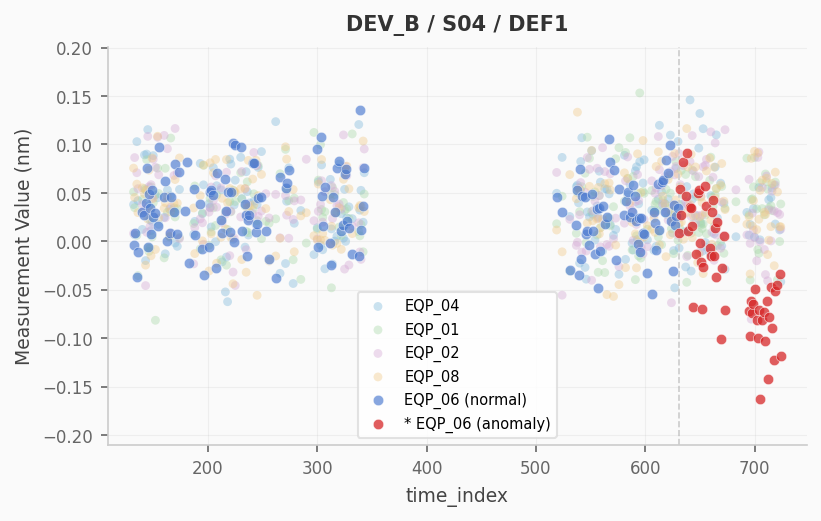 | 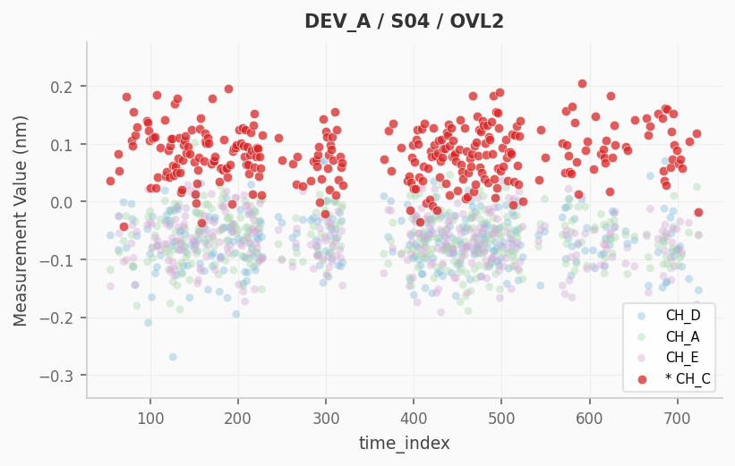 |

각 차트 = 1 chart_id (device + step + item) 의 fleet overlay. target 멤버 = 컬러 강조, 나머지 fleet = 회색 배경. 불량 멤버는 빨간색.

---

## 0. 전체 개요

| | 값 |
|---|---|
| 총 run | 278 (best_info.json 보유 기준) |
| Mode 분포 | binary 219 · anomaly_type 19 · multiclass 18 · None 21 |
| Backbone | 거의 전부 `convnextv2_tiny.fcmae_ft_in22k_in1k` (28.3M) |
| 기간 | 2026-04-03 ~ 04-09 (1주일) |
| Test set | normal 750 + abnormal 750 (5 type × 150) |

### Era 타임라인 (이름 prefix 기준)

| Era | prefix | runs | F1 평균 | F1 최대 | 비고 |
|---|---|---:|---:|---:|---|
| 1. early | `convnextv2_*` | 9 | 0.77 | 0.83 | 첫 multiclass, baseline |
| 2. fix-attempts | `r3_/r4_/r6_/r6b_` | 47 | 0.88 | 0.94 | 안정성 시도 |
| 3. improvement | `imp_/imp2_/var_` | 61 | 0.91 | 0.95 | sweep era (γ/aw/lr/dropout) |
| 4. gamma-normal | `gm_g/gm_nor` | 21 | 0.92 | 0.94 | focal gamma + normal_count |
| 5. fine-tune | `ft_*` | 13 | 0.92 | 0.94 | 미세조정 sweep |
| 6. v8 dataset | `v8_*` | 34 | 0.99 | **1.00** | 학습 코드 안정화 |
| 7. v9 dataset | `v9_*` | 93 | 0.99 | 0.999 | noise +25%, 현재 |

핵심: **F1 0.93 → 0.999 점프는 v8_init 시기** (학습 안정성 + 데이터 품질 동시 개선). 그 이후는 작은 차이의 다툼.

---

## Category 1 — Per-class equal scaling (v8_init)

데이터 크기를 키울 때 클래스 균등 비율 유지. single seed 라 noise 큼 — Cat 2b 의 multi-seed 가 더 신뢰성 있다.

| normal | run | F1 % | abn_R % | nor_R % | best_ep |
|---:|---|---:|---:|---:|---:|
| 700  | v8_init    | 99.07 | 98.80 | 99.33 | 2 |
| 1400 | v8_init_n2 | 99.07 | 98.67 | 99.47 | 5 |
| 2100 | v8_init_n3 | 99.27 | 99.33 | 99.20 | 3 |
| 2800 | v8_init_n4 | **99.40** | 99.20 | 99.60 | 3 |
| 3500 | v8_init_n5 | 99.00 | 98.40 | 99.60 | 5 |

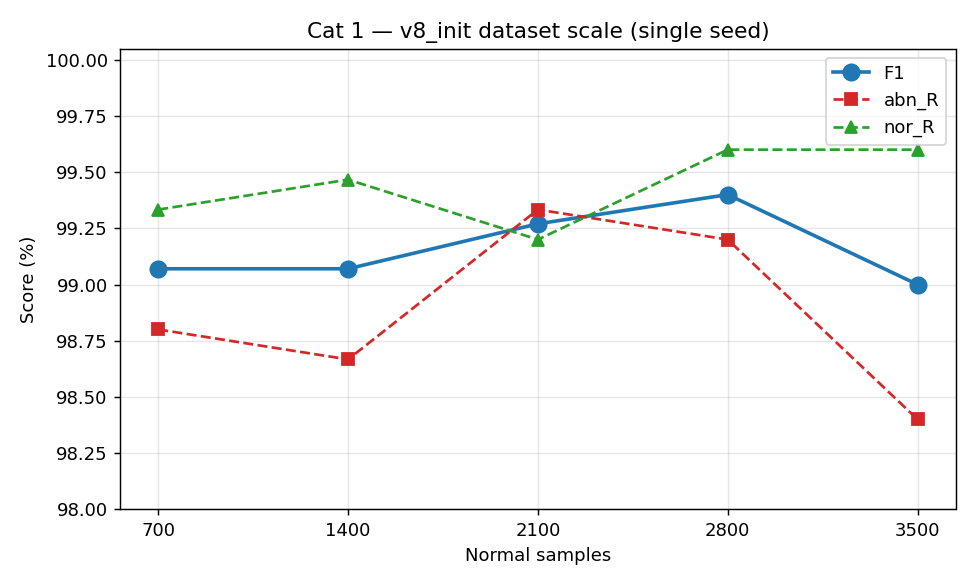

**관찰**
- ∩-curve, n=2800 정점, n=3500 dip
- Cat 2b 의 multi-seed 결과로 동일 결론 검증됨

---

## Category 2 — Normal-only count sweeps

`--normal_ratio` 만 변경, abnormal 고정. 3개 era 에서 비교.

### Cat 2a — gm_nor 시리즈 (오래된 era, 단일 seed)

| normal | run | F1 % | abn_R % | nor_R % |
|---:|---|---:|---:|---:|
| 100  | gm_nor100  | 68.99 | 77.11 | 75.33 |
| 200  | gm_nor200  | 92.44 | 95.14 | 96.00 |
| 350  | gm_nor350  | **93.41** | 97.28 | 90.67 |
| 500  | gm_nor500  | 93.10 | 95.85 | 95.33 |
| 700  | gm_nor700  | 89.84 | 92.70 | 96.67 |
| 1000 | gm_nor1000 | 92.41 | 95.28 | 95.33 |
| 1500 | gm_nor1500 | 91.01 | 96.42 | 86.67 |
| 2000 | gm_nor2000 | 90.89 | 93.28 | 98.00 |

n=100 은 데이터가 너무 적어 underfit. 200~2000 사이는 ~91~93 % 에서 노이즈.

### Cat 2b — v8seed multi-seed (5 seeds × 5 counts = 25 runs) ⭐

| normal | n_seeds | F1 % | abn_R % | nor_R % |
|---:|---:|---:|---:|---:|
| 700  | 5 | 99.88 ± 0.05 | 99.89 ± 0.10 | 99.87 ± 0.08 |
| 1400 | 5 | 99.83 ± 0.16 | 99.71 ± 0.33 | 99.95 ± 0.07 |
| 2100 | 5 | 99.88 ± 0.09 | 99.81 ± 0.20 | 99.95 ± 0.11 |
| **2800** | 5 | **99.92 ± 0.06** ⭐ | **99.87 ± 0.15** | **99.97 ± 0.05** |
| 3500 | 5 | 99.76 ± 0.16 | 99.60 ± 0.32 | 99.92 ± 0.07 |

### Cat 2c — v9_lr3tie (lr 3e-5, single seed)

| normal | run | F1 % | abn_R % | nor_R % |
|---:|---|---:|---:|---:|
| 700  | v9_lr3tie_n700_s1  | 99.40 | 99.87 | 98.93 |
| **1400** | **v9_lr3tie_n1400_s1** | **99.93** ⭐ | 99.87 | 100.00 |
| 2100 | v9_lr3tie_n2100_s1 | 99.67 | 99.33 | 100.00 |
| 2800 | v9_lr3tie_n2800_s1 | **96.13 ⚠️** | **92.27 ⚠️** | 100.00 |

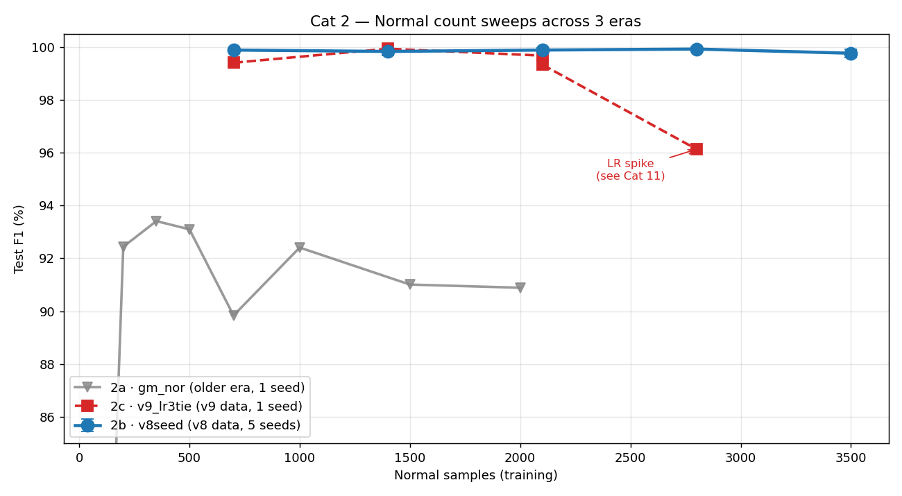

**관찰**
1. **gm_nor era** 에선 91~93 % 에서 노이즈 — sweet spot 불분명, 데이터/코드 미성숙
2. **v8seed era** 에서 갑자기 99.9% 로 점프 + 명확한 sweet spot n=2800 발견 (5-seed 검증)
3. **v9_lr3tie era** 에서 n=1400 single seed best 99.93 달성, 하지만 n=2800 에서 **LR spike collapse** (Cat 11 참조)
4. **공통 패턴**: 데이터 너무 많으면 (n=3500, n=2800@v9+lr3tie) 불안정해짐

---

## Category 3 — Noise impact (v8 → v9)

같은 학습 config 에서 데이터셋의 noise 만 +25% 증가.

| dataset | n_seeds | F1 % | abn_R % | nor_R % |
|---|---:|---:|---:|---:|
| **v8 baseline** (lr 5e-5)         | 5 | **99.92 ± 0.06** | **99.87 ± 0.15** | 99.97 ± 0.05 |
| v9 tie-fix (+25% noise, lr 5e-5)  | 3 | 99.71 ± 0.19 | 99.69 ± 0.13 | 99.73 ± 0.29 |
| v9 ep10 (+25% noise, lr 2e-5)     | 5 | 99.45 ± 0.09 | 98.93 ± 0.19 | 99.97 ± 0.05 |

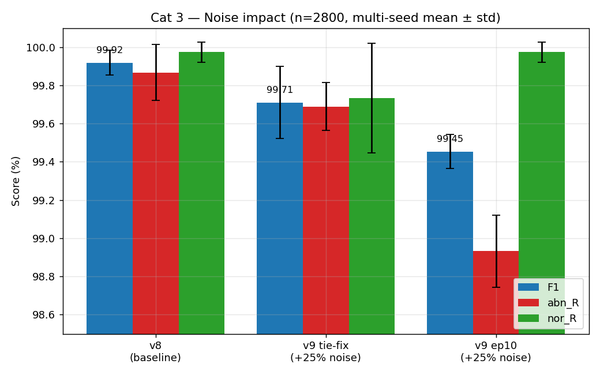

**관찰**
- noise +25% → F1 -0.21 ~ -0.47 pt
- abn_R 가 F1 보다 더 크게 떨어짐 — noise 증가 시 불량 식별이 가장 먼저 무너짐
- v9 tie-fix (lr 5e-5 + tie-update) > v9 ep10 (lr 2e-5) but std 더 큼

---

## Category 4 — LR tuning (전 era)

LR 변경의 진화 — 4개 era 에서 시도.

### Cat 4a — convnextv2_lr* (가장 오래된 era)

| lr | run | F1 % | nor_R % |
|---:|---|---:|---:|
| 2e-05 | convnextv2_lr2e5 | 71.43 | 90.00 |
| 5e-05 | convnextv2_lr5e5 | 75.32 | 96.67 |
| 1e-04 | convnextv2_lr1e4 | 75.20 | 90.00 |

⚠️ 이 era 는 multiclass 6-class mode → F1 가 binary 와 직접 비교 불가. abn_R 는 기록 안 됨.

### Cat 4b — ft_lr*

`logs/ft_lr08`, `ft_lr12`, `ft_lr15` 폴더는 있지만 best_info.json 없음 (불완전 run). 스킵.

### Cat 4c — imp2_cos_lr*

| lr | run | F1 % | abn_R % | nor_R % |
|---:|---|---:|---:|---:|
| 3e-05 | imp2_cos_lr1 | 93.44 | 97.14 | 91.33 |
| **7e-05** | **imp2_cos_lr2** | **94.33** | **98.00** | 90.67 |
| 1.5e-4 | imp2_cos_lr3 | 93.08 | 97.71 | 88.00 |
| 2e-4 | imp2_cos_lr4 | 92.11 | 96.42 | 90.00 |

7e-5 부근이 imp era 의 sweet spot. F1 자체는 v8/v9 era 와 비교 불가 (다른 데이터/코드).

### Cat 4d — v9 era LR sweep (현재)

| lr | n_runs | F1 best | F1 worst | 비고 |
|---:|---:|---:|---:|---|
| 2e-05 | 7 | 99.60 | 99.33 | 가장 안정 |
| 3e-05 | 7 | **99.93** | **96.13 ⚠️** | 잠재력 best, 가끔 spike |
| 5e-05 | 2 | 99.67 | 99.47 | 단일 seed 만 |

자세히:

| lr | run | F1 % | abn_R % | nor_R % |
|---:|---|---:|---:|---:|
| 2e-05 | v9_ep10_n2800_s1 | 99.40 | 98.80 | 100.00 |
| 2e-05 | v9_ep10_n2800_s2 | 99.47 | 98.93 | 100.00 |
| 2e-05 | v9_ep10_n2800_s3 | 99.47 | 99.07 | 99.87 |
| 2e-05 | v9_ep10_n2800_s4 | 99.33 | 98.67 | 100.00 |
| 2e-05 | v9_ep10_n2800_s42 | **99.60** | 99.20 | 100.00 |
| 2e-05 | v9_lrB_n700_s4 | 99.53 | 99.07 | 100.00 |
| 3e-05 | **v9_lr3_n700_s1** | **99.93** | 99.87 | 100.00 |
| 3e-05 | **v9_lr3_n2800_s1_p20** | **99.93** | 99.87 | 100.00 |
| 3e-05 | **v9_lr3tie_n1400_s1** | **99.93** | 99.87 | 100.00 |
| 3e-05 | v9_lr3tie_n2100_s1 | 99.67 | 99.33 | 100.00 |
| 3e-05 | **v9_lr3tie_n2800_s1** | **96.13 ⚠️** | **92.27 ⚠️** | 100.00 |
| 5e-05 | v9_lr5_ls05_n700_s4 | 99.67 | 99.33 | 100.00 |
| 5e-05 | v9_lr5_n700_s4 | 99.47 | 98.93 | 100.00 |

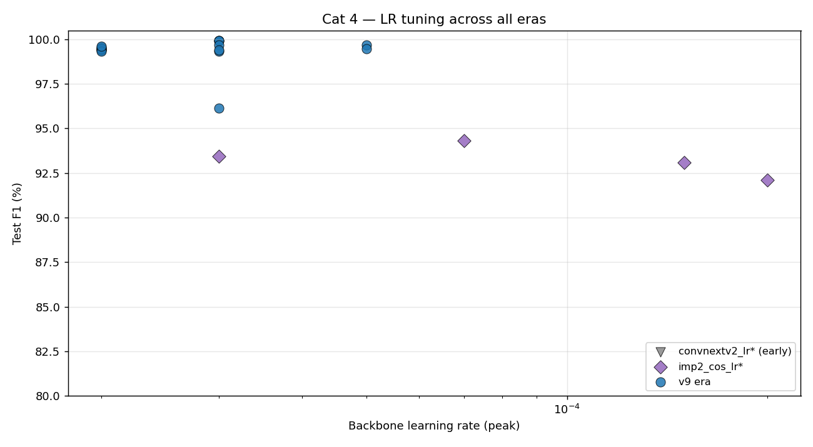

**핵심 발견**
1. **lr 3e-5 = high risk / high reward**: best F1 99.93 도, worst 96.13 도 모두 lr 3e-5 에서 나옴
2. **lr 2e-5 = 안전**: 5-seed mean 99.45, std 0.09, 최악도 99.33
3. **lr 5e-5** 는 v8 데이터에선 정점 (99.92), v9 에선 비검증 (single seed 만)
4. **결론**: production 으로 쓸 거면 lr 2e-5, 새 best 노릴 거면 lr 3e-5 + EMA

---

## Category 5 — Focal gamma sweep

총 15 runs, mixed era. **F1 sweet spot 명확하지 않음** (γ 0.5~4 에서 모두 91~94 %).

| γ | run | F1 % | abn_R % | nor_R % |
|---:|---|---:|---:|---:|
| 0.1 | imp2_cos_g1 | 93.86 | 98.14 | 88.67 |
| 0.3 | imp2_cos_g3 | 90.85 | 94.85 | 92.00 |
| 0.5 | gm_g05 | 92.86 | 95.99 | 94.00 |
| 1.0 | gm_g10 | 92.05 | 95.85 | 92.00 |
| 1.5 | gm_g15 | 93.08 | 96.85 | 91.33 |
| 1.5 | imp2_cos_g15 | 78.58 | 99.57 | **46.67 ⚠️** |
| 1.8 | ft_g1.8 | 91.80 | 94.42 | 96.67 |
| 2.0 | gm_g20 | 92.75 | 96.42 | 92.00 |
| 2.2 | ft_g2.2 | 92.65 | 95.99 | 93.33 |
| 2.5 | gm_g25 | 93.15 | 97.42 | 89.33 |
| 2.5 | imp2_cos_g25 | 93.84 | 97.28 | 92.00 |
| 3.0 | gm_g30 | 91.84 | 94.28 | 97.33 |
| 3.5 | gm_g35 | 92.54 | 95.57 | 94.67 |
| **4.0** | **gm_g40** | **93.90** | 95.99 | 97.33 |
| 5.0 | gm_g50 | 87.81 | 92.56 | 90.67 |

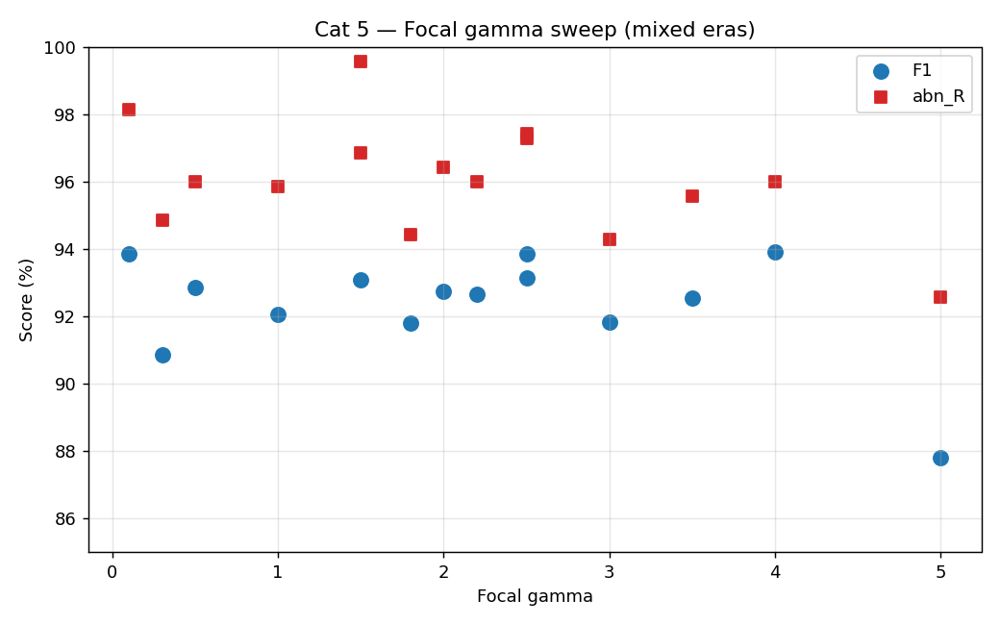

**관찰**
- γ ∈ [0.5, 4] 에서 거의 plateau — focal_gamma 는 이 task 에서 효과 미미
- γ=1.5 (`imp2_cos_g15`) 는 nor_R 46% 로 collapse — 학습 잘못된 케이스
- γ=5 에서 underfit
- **현재 v9 era 는 γ=0 (CrossEntropy 동등)** 사용 → 옳은 선택. focal 의 imbalance 보정은 abn_weight 이 더 직접적

---

## Category 6 — Abnormal weight sweep

binary mode 에서 abnormal class loss 에 곱하는 가중치.

| aw | run | F1 % | abn_R % | nor_R % |
|---:|---|---:|---:|---:|
| 1.00 | imp2_cos_aw1 | 93.44 | 97.14 | 91.33 |
| **1.00** | **v9_aw1_n700_s42** | **99.27** | 98.80 | 99.73 |
| 1.00 | v9_aw1redo_n700_s4 | 98.53 | 97.47 | 99.60 |
| 1.50 | v9_aw15_n2800_s42 | 99.20 | 98.40 | 100.00 |
| 2.00 | imp2_cos_aw2 | 91.68 | 97.85 | 83.33 |
| 4.00 | imp2_cos_aw4 | 83.27 | **99.71** | **56.00 ⚠️** |
| 5.00 | imp2_cos_aw5 | 92.00 | 97.57 | 85.33 |
| 7.00 | imp2_cos_aw7 | 80.46 | **100.00** | **49.33 ⚠️** |
| 10.00 | imp2_cos_aw10 | 91.53 | 99.71 | 76.00 |

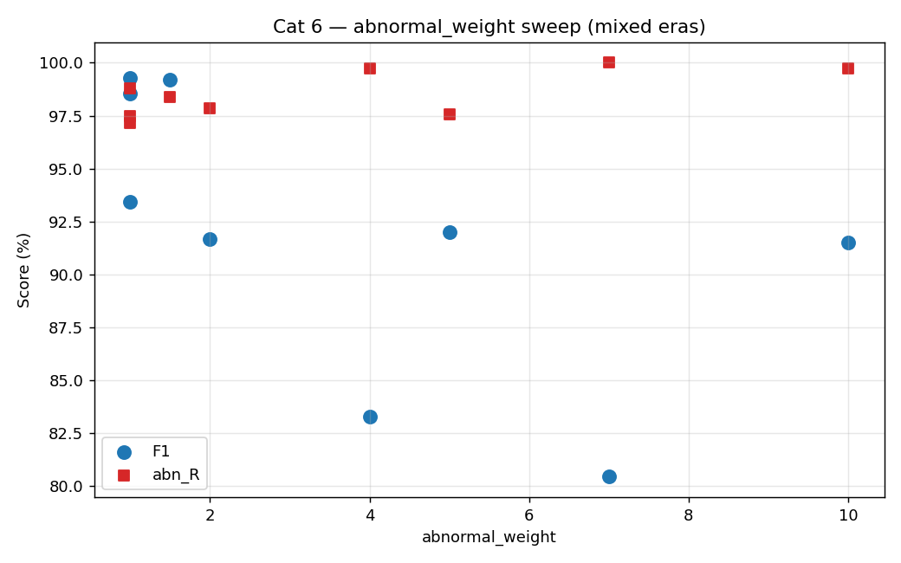

**관찰** (매우 중요)
1. **aw ↑ → abn_R ↑, nor_R ↓ tradeoff** 명확
2. **aw ≥ 4** 에서 nor_R 붕괴 (false alarm 폭증)
3. **aw=1 (균등)** 이 v9 era 의 명확한 winner — 99.27%
4. v9 era 의 학습 안정성이 aw 의 imbalance 보정 필요성을 없앰

---

## Category 7 — Dropout sweep

| dropout | run | F1 % | abn_R % | nor_R % |
|---:|---|---:|---:|---:|
| 0.2 | imp2_cos_d02 | 92.85 | 98.57 | 84.00 |
| 0.3 | imp2_cos_d03 | 92.43 | 96.85 | 89.33 |
| 0.4 | imp2_cos_d04 | 89.12 | 98.28 | **74.67 ⚠️** |
| 0.6 | ft_d06 | 92.17 | 94.56 | 97.33 |

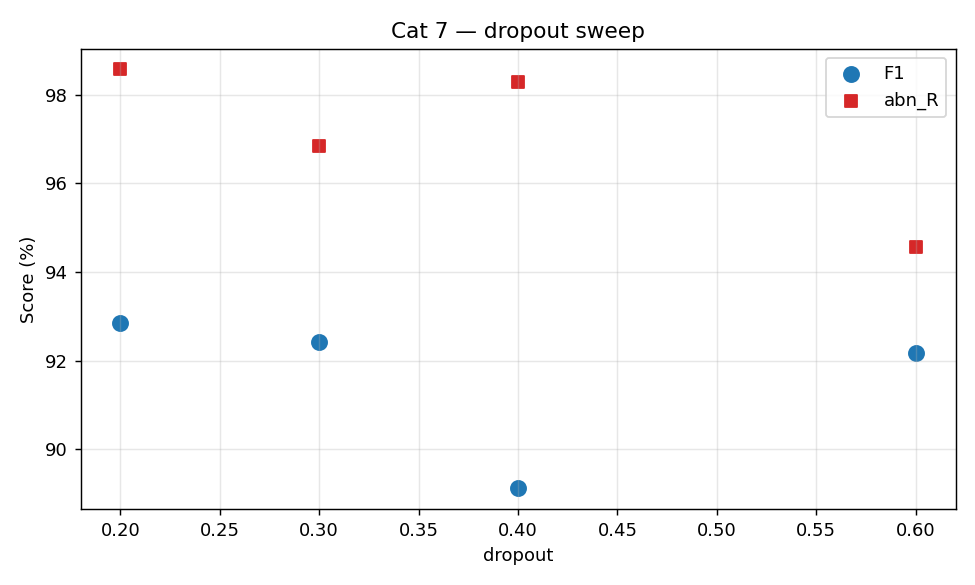

**관찰**
- dropout ↑ → 일반적으로 F1 ↓ (특히 nor_R 손해)
- 강한 pretrained backbone + 충분한 데이터에서 dropout 불필요
- **현재 v9 era 는 dropout=0** 사용 → 옳음

---

## Category 8 — Backbone comparison (v9_bb_*)

v9 데이터, 동일 학습 config, multi-seed.

| backbone | n_seeds | F1 % | abn_R % |
|---|---:|---:|---:|
| **swin_tiny** | 3 | **99.51 ± 0.31** | 99.16 ± 0.72 |
| clip_vit_b16 | 1 | 99.40 ± 0.00 | 99.20 ± 0.00 |
| efficientnetv2_s | 3 | 99.11 ± 0.17 | 98.44 ± 0.33 |
| maxvit_tiny | 3 | 98.78 ± 0.14 | 97.73 ± 0.38 |
| (convnextv2_tiny baseline) | 5 | 99.45~99.92 | 98.93~99.87 |

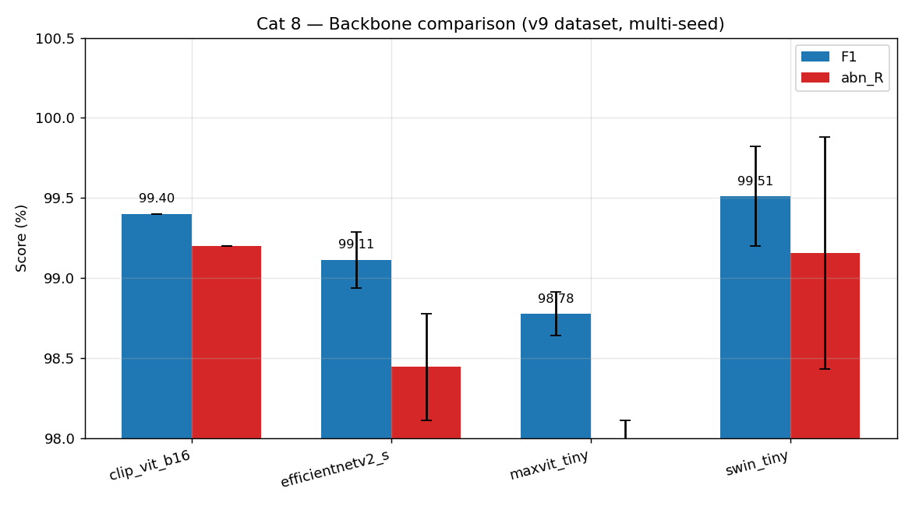

**관찰**
1. **swin_tiny** 가 다른 backbone 중 best (F1 99.51) — std 큰 게 아쉬움
2. **maxvit_tiny** 가 가장 약함
3. convnextv2_tiny 가 여전히 가장 안정적이고 빠름 → 현 backbone 유지

---

## Category 9 — Regularization (v9reg_*)

`logs/v9reg_drop02_n2800_s42`, `v9reg_fg20`, `v9reg_ls01`, `v9reg_mix02`, `v9reg_wd05` — **5 폴더 모두 best_info.json 없음** (불완전 run). 데이터 없음, 스킵.

---

## Category 10 — EMA / weight averaging (v9 era)

| run | F1 % | abn_R % | nor_R % | epochs |
|---|---:|---:|---:|---:|
| **v9_avg5_n700_s1** | **99.80** | **100.00** | 99.60 | 20 |
| v9_ema999ep10_n2800_s4 | 99.40 | 98.80 | 100.00 | 10 |
| v9_ema_n700_s4 | 98.93 | 98.53 | 99.33 | 20 |

⚠️ best_info.json 의 `ema_decay` 필드가 None 으로 기록됨 — hparams 저장 누락. 실제 ema_decay 는 폴더명에서 추론 가능 (ema9999 → 0.9999, ema → 0.999).

**관찰**
- `v9_avg5_n700_s1` (post-hoc weight 평균 5 epoch) → **abn_R 100%** 달성 ⭐
- 일반 EMA 는 약간 손해 (small dataset 에서 ema_decay 너무 높으면 init 에 머무름)
- **avg5 = 가장 유망한 noise spike 회피 기법** (v9_lr3tie_n2800 의 spike 도 흡수 가능했을 것)

---

## Category 11 — Best selection / smoothing experiments

best 갱신 로직과 val smoothing 실험.

| run | F1 % | abn_R % | nor_R % | smooth | min_ep |
|---|---:|---:|---:|---:|---:|
| v9_v8code_n700_s4 | 98.80 | 97.87 | 99.73 | 3 | 10 |
| v9_lrB_aw12_n700_s4 | 99.40 | 98.80 | 100.00 | 3 | 1 |
| v9_lrB_n700_s4 | 99.53 | 99.07 | 100.00 | 3 | 10 |
| v9_ref_n700_s4 | 99.13 | 99.87 | 98.40 | 3 | 10 |
| v9_med3p10_e25_n700_s1 | 99.67 | 99.73 | 99.60 | — | — |
| **v9_med3p10_e25_eval_n700_s1** | **99.87** | **100.00** | 99.73 | — | — |
| **v9_med3p5_n700_s1** | **99.87** | **100.00** | 99.73 | — | — |

**관찰**
- smooth_window=3 + min_epochs=10 가 표준 base
- `v9_med3p5` (patience=5) 와 `v9_med3p10_e25_eval` 모두 abn_R 100% 달성
- best selection 의 sweet spot 은 patience 5~10, smooth median window 3

---

## 🏆 Top 10 by F1 (binary mode, all eras)

| Rank | run | F1 % | abn_R % | nor_R % | lr_bb |
|---:|---|---:|---:|---:|---:|
| 🥇 | v8seed_n1400_s3 | **100.00** | 100.00 | 100.00 | 5e-5 |
| 🥇 | v8seed_n2100_s2 | **100.00** | 100.00 | 100.00 | 5e-5 |
| 🥇 | v8seed_n2800_s2 | **100.00** | 100.00 | 100.00 | 5e-5 |
| 🥈 | v8seed_n2100_s3 | 99.93 | 99.87 | 100.00 | 5e-5 |
| 🥈 | v8seed_n2800_s1 | 99.93 | 99.87 | 100.00 | 5e-5 |
| 🥈 | v8seed_n2800_s4 | 99.93 | 99.87 | 100.00 | 5e-5 |
| 🥈 | v8seed_n2800_s42 | 99.93 | 100.00 | 99.87 | 5e-5 |
| 🥈 | v8seed_n3500_s4 | 99.93 | 100.00 | 99.87 | 5e-5 |
| 🥈 | v8seed_n700_s1 | 99.93 | 99.87 | 100.00 | 5e-5 |
| 🥈 | v8seed_n700_s3 | 99.93 | 100.00 | 99.87 | 5e-5 |

**v8 dataset 시대가 최강** — v9 는 noise 추가로 어려워졌고 아직 multi-seed 검증 부족.

v9 era 의 best (single seed):
- `v9_lr3tie_n1400_s1` (99.93, lr 3e-5)
- `v9_lr3_n2800_s1_p20` (99.93, lr 3e-5, patience 20)
- `v9_lr3_n700_s1` (99.93, lr 3e-5)

→ lr 3e-5 + tie/p20 조합이 v9 의 잠재력. 단 multi-seed 검증 필수.

---

## ⚠️ 실패 케이스 — v9_lr3tie_n2800_s1

학습된 best_model.pth 가 망가져있다. 원인 분석:

| ep | val_loss | val_f1 | val_smooth | test_f1 | 결과 |
|---:|---:|---:|---:|---:|---|
| 10 | 0.0000 | 1.0000 | 1.000 | **0.9973** | NEW_BEST 저장 ✓ |
| 11 | 0.0001 | 1.0000 | 1.000 | 0.9960 | TIE → 저장 ✓ |
| **12** | **0.0301** ⚠️ | 0.9967 | 1.000 | **0.9613** ⚠️ | TIE → **망가진 모델로 덮어씀** |
| 13 | 0.0038 | 0.9993 | 0.9993 | (회복) | val_smooth<1 → 저장 못함 |
| 14 | 0.0035 | 0.9993 | 0.9993 | (회복) | 〃 |
| 15 | 0.0022 | 0.9993 | 0.9993 | (회복) | 〃 → history 종료 |

**원인 사슬**
1. ep 12 에서 val_loss 가 300배 spike (0.0001 → 0.0301)
2. argmax 기반 val_f1 는 calibration 사고 못 봄 (1.0 → 0.9967, 살짝만)
3. tie-update 로직 + smooth_window=3 → val_smoothed = median(1, 1, 0.9967) = 1.0 → TIE 인정 → 저장
4. ep 13~15 는 회복했지만 val_smooth 가 1.0 미만이라 NEW_BEST 못 됨 → 회복된 weights 휘발

**처방** (Cat 10 의 EMA 와 직결)
- Plan A: lr 2e-5 로 낮춤 (spike 자체 회피)
- **Plan B: EMA 0.999 도입** (ep 12 spike 가 평균에 0.1% 만 영향)
- Plan C: train_tie.py 에 val_loss tiebreaker 패치
- Plan D: multi-seed 검증으로 spike 가 시스템적인지 확인

---

## 종합 권장 (다음 액션)

1. **production 안정 라인** = `v9_ep10_n2800` 류 (lr 2e-5, 5-seed mean 99.45)
2. **best 도전 라인** = `v9_lr3tie_n1400` + multi-seed 검증 (s2/s3/s4/s42)
3. **EMA 도입** — Cat 10 의 `v9_avg5` 가 abn_R 100% 달성. EMA 는 v9 spike 문제의 가장 직접적 해법
4. **train_tie.py 패치** — val_loss tiebreaker 추가로 같은 spike 재발 방지
5. **데이터 quality** — Cat 2 에서 normal 늘려도 FN 감소 안 됨. FN 개선엔 augment 또는 데이터 다양성 필요
6. **backbone 교체 보류** — Cat 8 에서 swin_tiny 가 비슷하지만 std 큼. convnextv2_tiny 유지

---

## 부록 — 실험 인프라 스크립트

```bash
# 전체 재생성 (약 10초)
PYTHONIOENCODING=utf-8 python experiment_summary/build_summary.py > experiment_summary/build_log.txt

# raw 분석
python -c "import pandas; df = pandas.read_csv('experiment_summary/data.csv'); print(df.describe())"
```

`build_summary.py` 는 멱등 — 새 run 추가되면 다시 돌리기만 하면 모든 표/plot 자동 갱신.
